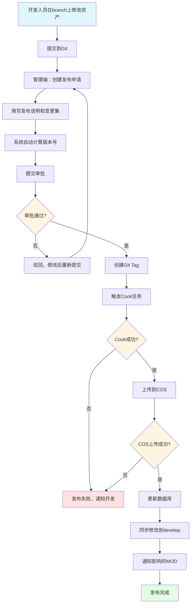
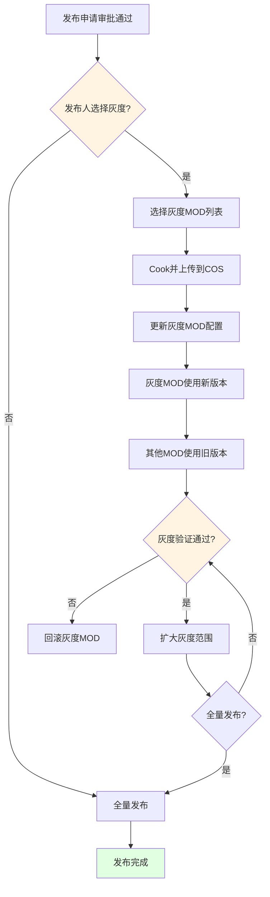
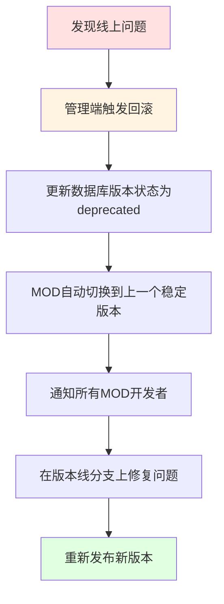

# 离散化公共资产仓库 - 发布流程设计

**文档版本**: v1.0  
**讨论日期**: 2026-01-10  
**状态**: 设计中

---

## 一、版本管理策略

### 1.1 Git权限控制

#### 核心原则
- **所有Git操作必须通过管理端**：管理端后台执行Git命令
- **普通用户无直接Git权限**：不允许直接push、merge等操作
- **权限分级**：
  - 普通开发者：通过管理端提交资产修改申请
  - 审批人：通过管理端审批发布
  - 系统管理员：管理端后台拥有Git完整权限

#### 管理端Git操作封装
```python
class GitOperationService:
    """
    管理端Git操作服务，封装所有Git命令
    """
    
    def create_branch(self, base_branch, new_branch, operator):
        """创建版本线分支"""
        # 权限检查
        if not self.check_permission(operator, 'create_branch'):
            raise PermissionError("无权限创建分支")
        
        # 执行Git命令
        subprocess.run(['git', 'checkout', base_branch])
        subprocess.run(['git', 'pull'])
        subprocess.run(['git', 'checkout', '-b', new_branch])
        subprocess.run(['git', 'push', 'origin', new_branch])
        
        # 记录操作日志
        self.log_operation('create_branch', operator, new_branch)
    
    def create_tag(self, branch, tag_name, operator):
        """创建发布Tag"""
        if not self.check_permission(operator, 'create_tag'):
            raise PermissionError("无权限创建Tag")
        
        subprocess.run(['git', 'checkout', branch])
        subprocess.run(['git', 'tag', tag_name])
        subprocess.run(['git', 'push', 'origin', tag_name])
        
        self.log_operation('create_tag', operator, tag_name)
    
    def dual_commit(self, branch, files, commit_message, operator):
        """双线提交：同时提交到版本线分支和develop"""
        if not self.check_permission(operator, 'commit'):
            raise PermissionError("无权限提交代码")
        
        commits = []
        
        # 1. 提交到版本线分支
        subprocess.run(['git', 'checkout', branch])
        subprocess.run(['git', 'add'] + files)
        result = subprocess.run(['git', 'commit', '-m', commit_message], capture_output=True)
        branch_commit = self.get_last_commit_hash()
        subprocess.run(['git', 'push', 'origin', branch])
        commits.append({'branch': branch, 'commit': branch_commit})
        
        # 2. 同步提交到develop分支
        subprocess.run(['git', 'checkout', 'develop'])
        subprocess.run(['git', 'add'] + files)
        subprocess.run(['git', 'commit', '-m', commit_message])
        develop_commit = self.get_last_commit_hash()
        subprocess.run(['git', 'push', 'origin', 'develop'])
        commits.append({'branch': 'develop', 'commit': develop_commit})
        
        # 3. 记录操作日志
        self.log_operation('dual_commit', operator, commits)
        
        return commits
```

### 1.2 分支与Tag策略

#### 核心原则
- **develop分支**：主开发分支，持续迭代，不对外发布
- **版本线分支**：从develop拉出，作为已发布版本的修复分支，发布后保留
- **Tag**：不可变的发布快照，MOD只能引用Tag

#### 版本演进示例
```
develop (主开发分支)
    ↓ 拉出版本线
branch_v1.0.0
    ↓ 首次发布
tag_v1.0.0
    ↓ 修改资产A、B、C
tag_v1.0.1
    ↓ 修改资产G、H、J、K
tag_v1.0.2
    ↓ 同步所有修改到develop
develop (包含v1.0.x所有修复)
    ↓ 拉出新版本线
branch_v1.1.0
    ↓ 首次发布
tag_v1.1.0
    ↓ 修改...
tag_v1.1.1
```

#### 为什么新大版本必须从develop拉出？
- **序列化兼容性**：随着引擎升级，资产序列化格式可能发生变化
- **技术债务清理**：develop分支包含所有历史修复和优化
- **架构演进**：新版本可能需要重构资产组织结构

#### 分支生命周期
- **版本线分支永久保留**：用于历史版本的问题修复和回溯
- **develop分支持续演进**：作为所有新版本的基准

### 1.3 版本号规则

#### 语义化版本号
```
v{主版本}.{次版本}.{修订版本}

示例：v1.0.3
```

#### 版本升级规则
| 版本类型 | 升级条件 | 示例 |
|---------|---------|------|
| **主版本** | 不兼容的资产修改（如材质系统重构） | v1.0.3 → v2.0.0 |
| **次版本** | 向下兼容的功能性新增（如新增资产包） | v1.0.3 → v1.1.0 |
| **修订版本** | 向下兼容的问题修正（如材质bug修复） | v1.0.3 → v1.0.4 |

#### 管理端校验规则
- ✅ 版本号必须递增
- ✅ 主版本升级必须从develop拉出新分支
- ✅ 次版本和修订版本在版本线分支上发布
- ✅ 修改必须同步回develop

---

## 二、发布流程设计

### 2.1 完整发布流程



### 2.2 资产修改与发布流程（双线提交模式）

#### 阶段1：资产修改
**执行者**：美术/技术人员  
**操作**：通过管理端上传修改后的资产

#### 阶段2：双线提交
**执行者**：管理端后台  
**核心机制**：每次资产修改产生2个commit，分别提交到版本线分支和develop分支

**操作流程**：
```bash
# 1. 提交到版本线分支
git checkout branch_v1.0.0
git add AssetRepo/Scene/ChinaCastle/*
git commit -m "fix: 修复ChinaCastle材质显示问题"
git push origin branch_v1.0.0

# 2. 同步提交到develop分支
git checkout develop
git add AssetRepo/Scene/ChinaCastle/*
git commit -m "fix: 修复ChinaCastle材质显示问题"
git push origin develop
```

**管理端界面提示**：
```
┌─────────────────────────────────────────┐
│  资产提交确认                           │
├─────────────────────────────────────────┤
│  修改资产: ChinaCastle                  │
│  提交信息: 修复材质显示问题             │
│                                         │
│  ✓ 将提交到 branch_v1.0.0               │
│  ✓ 将同步提交到 develop                 │
│                                         │
│  ⚠️ 注意：将产生2个commit               │
│                                         │
│  [确认提交]  [取消]                     │
└─────────────────────────────────────────┘
```

#### 阶段3：Cook并上传COS
**执行者**：构建服务器  
**操作**：
```bash
# 1. Cook资产（pakmeta文件会和其他资源一起打包进Pak）
RunUAT BuildCookRun \
  -project=AssetRepo \
  -platform=iOS+Android+Windows \
  -cook -pak

# 2. 计算MD5并重命名
for pak in *.pak; do
  md5=$(md5sum $pak | cut -d' ' -f1)
  mv $pak ${pak%.pak}_${md5}.pak
done

# 3. 上传到COS
for platform in iOS Android Windows; do
  cos_path="/prod/tag_v1.0.3/${platform}/"
  upload_to_cos $cos_path *.pak
done
```

**COS上传结果**：
```
/prod/tag_v1.0.3/iOS/ChinaCastle_a3f5e8d9c2b1f4e6.pak (包含pakmeta)
/prod/tag_v1.0.3/iOS/HeroWarrior_b7c8d9e0f1a2b3c4.pak (包含pakmeta)
/prod/tag_v1.0.3/Android/ChinaCastle_b2c3d4e5f6a7b8c9.pak
/prod/tag_v1.0.3/Android/HeroWarrior_c3d4e5f6a7b8c9d0.pak
...
```

**说明**：.pakmeta文件在构建时与其他资源文件一起打包进Pak，作为Pak的普通文件存在

#### 阶段4：同步到develop
**执行者**：开发人员手动（管理端提醒）  
**原因**：由于可能存在序列化格式变化，需要人工评估和处理  
**操作**：
```bash
git checkout develop
git cherry-pick <commit-hash-from-branch>
# 如有冲突或序列化问题，手动解决
git push origin develop
```

**管理端提醒界面**：
```
┌─────────────────────────────────────────┐
│  ⚠️ 待同步到develop                     │
├─────────────────────────────────────────┤
│  版本: v1.0.3                           │
│  分支: branch_v1.0.0                    │
│  提交: a1b2c3d4e5f6                     │
│                                         │
│  变更资产:                              │
│  • ChinaCastle                          │
│  • HeroWarrior                          │
│                                         │
│  ⚠️ 注意：请检查序列化兼容性            │
│                                         │
│  [已同步]  [查看详情]                   │
└─────────────────────────────────────────┘
```

#### 阶段5：通知影响的MOD
**通知内容**：
```
【公共资产仓库更新通知】

版本: v1.0.3
发布时间: 2026-01-10 19:00:00

变更资产:
• ChinaCastle - 修复材质透明度问题
• HeroWarrior - 优化性能

您的MOD "城堡大冒险" 引用了以下变更资产:
• ChinaCastle (当前使用v1.0.2)

建议操作:
1. 在测试环境验证新版本兼容性
2. 更新MOD的publicRepoVersion为1.0.3
3. 重新发布MOD

查看详情: https://manage.example.com/versions/v1.0.3
```

---

## 三、灰度发布机制

### 3.1 灰度发布流程

**决策者**：发布人在创建发布申请时选择是否灰度



### 3.2 灰度配置

#### 数据库记录
```sql
-- 版本表中的灰度字段
UPDATE asset_repo_versions
SET is_gray_release = TRUE,
    gray_mod_list = '["mod_12345", "mod_67890"]'
WHERE version = 'v1.0.3';
```

#### MOD解析资产时的逻辑
```python
def resolve_mod_assets(mod_id, public_repo_version):
    # 查询该版本是否为灰度发布
    version = db.query("SELECT * FROM asset_repo_versions WHERE version = ?", public_repo_version)
    
    if version.is_gray_release:
        gray_mod_list = json.loads(version.gray_mod_list)
        
        if mod_id in gray_mod_list:
            # 灰度MOD使用新版本
            return get_assets_from_version(public_repo_version)
        else:
            # 非灰度MOD使用上一个稳定版本
            stable_version = get_previous_stable_version(public_repo_version)
            return get_assets_from_version(stable_version)
    else:
        # 全量发布，直接返回
        return get_assets_from_version(public_repo_version)
```

### 3.3 灰度管理界面

```
┌─────────────────────────────────────────┐
│  灰度发布管理 - v1.0.3                   │
├─────────────────────────────────────────┤
│  当前状态: 灰度中                        │
│  灰度开始时间: 2026-01-10 19:00:00      │
│                                         │
│  灰度MOD列表 (2/100):                   │
│  ┌─────────────────────────────────┐   │
│  │ ☑ 城堡大冒险 (mod_12345)        │   │
│  │ ☑ 英雄传说 (mod_67890)          │   │
│  │ ☐ 冒险岛 (mod_11111)            │   │
│  │ ☐ ...                           │   │
│  └─────────────────────────────────┘   │
│                                         │
│  灰度监控:                              │
│  • 崩溃率: 0.01% (正常)                 │
│  • 加载时间: 平均2.3s (正常)            │
│  • 用户反馈: 0个问题                    │
│                                         │
│  [扩大灰度]  [全量发布]  [回滚]         │
└─────────────────────────────────────────┘
```

---

## 四、回滚机制

### 4.1 回滚场景

| 场景 | 回滚策略 | 操作 |
|-----|---------|------|
| **Cook失败** | 不创建Tag，发布失败 | 修复问题后重新发布 |
| **COS上传失败** | 删除Tag，发布失败 | 修复网络问题后重新发布 |
| **灰度验证失败** | 回滚灰度MOD配置 | 灰度MOD使用上一个稳定版本 |
| **线上问题** | 回滚COS，修复分支 | 1. COS切换到上一个Tag<br>2. 修复分支后重新发布 |

### 4.2 回滚操作流程

#### 场景：线上问题回滚


#### 回滚API
```http
POST /api/asset-repo/versions/{versionId}/rollback

Request:
{
    "reason": "发现材质加载崩溃问题",
    "targetVersion": "v1.0.2"  // 回滚到的目标版本
}

Response:
{
    "success": true,
    "currentVersion": "v1.0.2",
    "deprecatedVersion": "v1.0.3",
    "affectedMods": 15
}
```

---

## 五、MOD发布集成

### 5.1 MOD Manifest配置

#### 管理端填写（支持JSON导入）
**操作界面**：
```
┌─────────────────────────────────────────┐
│  MOD发布配置                             │
├─────────────────────────────────────────┤
│  MOD ID: mod_12345                      │
│  MOD名称: 城堡大冒险                     │
│                                         │
│  公仓版本: v1.0.3  [选择版本]           │
│                                         │
│  引用资产:                              │
│  ┌─────────────────────────────────┐   │
│  │ ☑ ChinaCastle                   │   │
│  │ ☑ HeroWarrior                   │   │
│  │ ☐ NPCVillager                   │   │
│  └─────────────────────────────────┘   │
│                                         │
│  [导入JSON]  [生成Manifest]  [发布]    │
└─────────────────────────────────────────┘
```

**JSON导入格式**：
```json
{
    "modId": "mod_12345",
    "modName": "城堡大冒险",
    "publicRepoVersion": "1.0.3",
    "assets": ["ChinaCastle", "HeroWarrior"]
}
```

#### 管理端生成最终Manifest
**生成逻辑**：
1. 根据publicRepoVersion查询数据库获取资产快照
2. 解析每个资产的MD5、COS路径和依赖关系
3. 生成完整的Manifest文件

**最终Manifest**：
```json
{
    "modId": "mod_12345",
    "modName": "城堡大冒险",
    "publicRepoVersion": "1.0.3",
    "assets": [
        {
            "pak": "ChinaCastle",
            "md5": "a3f5e8d9c2b1f4e6",
            "cosPath": "/prod/tag_v1.0.3/iOS/ChinaCastle_a3f5e8d9c2b1f4e6.pak",
            "dependencies": [
                {"pak": "CommonMaterial", "md5": "c1d2e3f4a5b6c7d8"}
            ]
        },
        {
            "pak": "HeroWarrior",
            "md5": "b7c8d9e0f1a2b3c4",
            "cosPath": "/prod/tag_v1.0.3/iOS/HeroWarrior_b7c8d9e0f1a2b3c4.pak",
            "dependencies": []
        }
    ]
}
```

### 5.2 版本兼容性检查

#### 核心策略
1. **APP大版本发布时**：强制所有MOD升级到最新公仓版本
2. **大版本运营期间**：
   - 提醒依赖到修改Pak的MOD评估升级
   - 未依赖修改Pak的MOD可以"过时但兼容"，无副作用

#### 检查逻辑
```python
def check_version_compatibility(mod_version, current_version, app_version_type, mod_dependencies):
    """
    检查MOD使用的公仓版本是否兼容
    
    Args:
        mod_version: MOD使用的公仓版本
        current_version: 当前最新公仓版本
        app_version_type: APP版本类型（major_release/normal_operation）
        mod_dependencies: MOD依赖的Pak列表
    """
    mod_major, mod_minor, mod_patch = parse_version(mod_version)
    cur_major, cur_minor, cur_patch = parse_version(current_version)
    
    # 主版本不同，不兼容
    if mod_major != cur_major:
        return {
            "compatible": False,
            "level": "major_breaking",
            "message": f"主版本不兼容，必须升级到v{cur_major}.x.x",
            "action": "force_upgrade"
        }
    
    # APP大版本发布时，强制升级
    if app_version_type == "major_release" and mod_version != current_version:
        return {
            "compatible": False,
            "level": "app_major_release",
            "message": f"APP大版本发布，必须升级到v{current_version}",
            "action": "force_upgrade"
        }
    
    # 大版本运营期间
    if mod_version != current_version:
        # 检查MOD依赖的Pak是否有变更
        changed_paks = get_changed_paks_between_versions(mod_version, current_version)
        affected_paks = set(mod_dependencies) & set(changed_paks)
        
        if affected_paks:
            # 依赖的Pak有变更，建议升级
            return {
                "compatible": True,
                "level": "dependency_changed",
                "message": f"依赖的资产包已更新：{', '.join(affected_paks)}，建议升级到v{current_version}",
                "action": "recommend_upgrade",
                "affectedPaks": list(affected_paks)
            }
        else:
            # 依赖的Pak无变更，过时但兼容
            return {
                "compatible": True,
                "level": "outdated_but_compatible",
                "message": f"当前使用v{mod_version}，最新版本v{current_version}，您的依赖资产未变更，可继续使用",
                "action": "optional_upgrade"
            }
    
    return {
        "compatible": True,
        "level": "up_to_date",
        "message": "版本最新",
        "action": "none"
    }

def get_changed_paks_between_versions(from_version, to_version):
    """
    获取两个版本之间变更的Pak列表
    """
    changesets = db.query("""
        SELECT DISTINCT ap.pak_name
        FROM version_changesets vc
        JOIN asset_packages ap ON vc.asset_package_id = ap.id
        JOIN asset_repo_versions v ON vc.version_id = v.id
        WHERE v.version > ? AND v.version <= ?
    """, from_version, to_version)
    
    return [row['pak_name'] for row in changesets]
```

#### 管理端提醒界面
```
┌─────────────────────────────────────────┐
│  MOD版本兼容性检查                       │
├─────────────────────────────────────────┤
│  MOD: 城堡大冒险 (mod_12345)            │
│  当前公仓版本: v1.0.2                   │
│  最新公仓版本: v1.0.5                   │
│                                         │
│  ⚠️ 建议升级                            │
│                                         │
│  原因：                                 │
│  您依赖的以下资产包已更新：              │
│  • ChinaCastle (v1.0.3修复材质问题)     │
│                                         │
│  影响评估：                             │
│  • 材质显示可能不一致                   │
│  • 建议在测试环境验证                   │
│                                         │
│  [立即升级]  [稍后提醒]  [查看详情]     │
└─────────────────────────────────────────┘
```

---

## 六、监控与告警

### 6.1 发布监控指标

| 指标 | 说明 | 告警阈值 |
|-----|------|---------|
| **Cook成功率** | Cook任务成功比例 | < 95% |
| **COS上传成功率** | COS上传成功比例 | < 99% |
| **发布耗时** | 从审批到完成的时间 | > 30分钟 |
| **MOD兼容性** | 使用新版本的MOD崩溃率 | > 0.1% |
| **资产加载时间** | Pak加载平均耗时 | > 5秒 |

### 6.2 告警通知

#### 企业微信通知
```
【公共资产仓库告警】

告警类型: Cook失败
版本: v1.0.3
平台: iOS
失败原因: 材质编译错误

详情:
ChinaCastle/Materials/M_Wall.uasset
编译错误: Shader compilation failed

处理建议:
1. 检查材质节点配置
2. 验证Shader代码
3. 重新提交发布申请

查看详情: https://manage.example.com/alerts/123
```

---

## 七、待办事项

### 7.1 技术实现
- [ ] 管理端Git操作封装（权限控制 + 日志审计 + 双线提交）
- [ ] 版本兼容性检查服务
- [ ] COS上传服务（支持断点续传）
- [ ] 构建服务（多平台Cook + MD5计算 + pakmeta打包）
- [ ] 灰度发布控制逻辑
- [ ] pakmeta文件生成与打包工具

### 7.2 数据库设计
- [ ] 版本表（asset_repo_versions）
- [ ] 资产快照表（asset_snapshots）
- [ ] 变更集表（version_changesets）
- [ ] MOD依赖表（mod_dependencies）
- [ ] 发布记录表（release_records）
- [ ] 双线提交记录表（dual_commit_records）

### 7.3 管理端界面
- [ ] 版本管理页面
- [ ] 发布申请页面
- [ ] 审批流程页面
- [ ] MOD发布配置页面
- [ ] 版本兼容性检查页面
- [ ] 双线提交确认界面

### 7.4 工具开发
- [ ] UE4 Editor插件：资产录入工具
- [ ] 引用修复工具：扫描并修复硬编码路径
- [ ] 配置表引用扫描工具
- [ ] Lua脚本引用扫描工具
- [ ] 依赖计算工具（自动更新.pakmeta）

### 7.5 文档输出
- [ ] 开发者使用手册
- [ ] 管理端操作指南
- [ ] API接口文档
- [ ] 故障排查手册

---

## 八、下一步行动

1. **确认技术方案**（本周）
   - 评审本文档
   - 确认数据库设计
   - 确认API接口

2. **原型开发**（下周）
   - 搭建管理端框架
   - 实现版本管理核心功能
   - 开发Cook和上传流程

3. **工具开发**（2周）
   - UE4 Editor插件
   - 依赖计算工具
   - 引用修复工具

4. **测试验证**（1周）
   - 单元测试
   - 集成测试
   - 压力测试

5. **试点上线**（1周）
   - 选择1-2个资产包试点
   - 收集反馈
   - 优化流程

---

**文档结束**