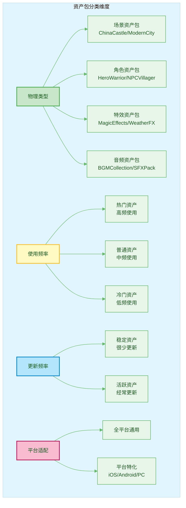
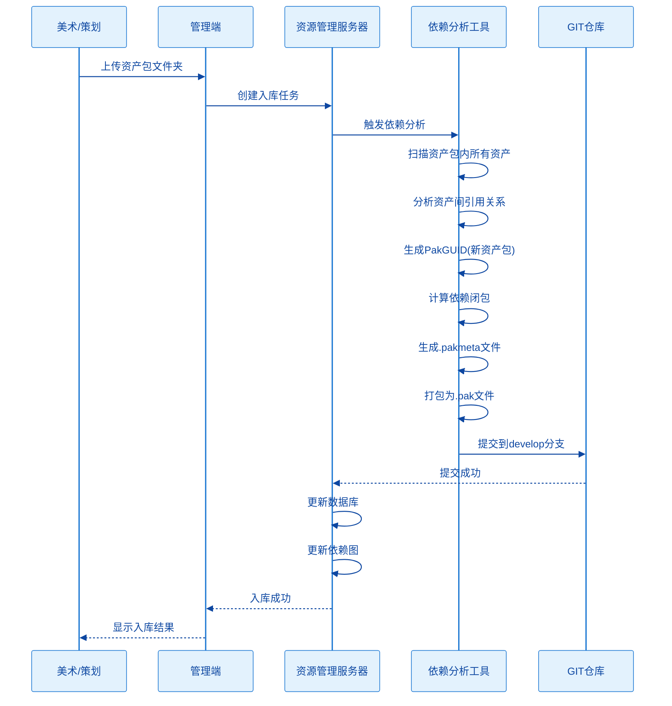
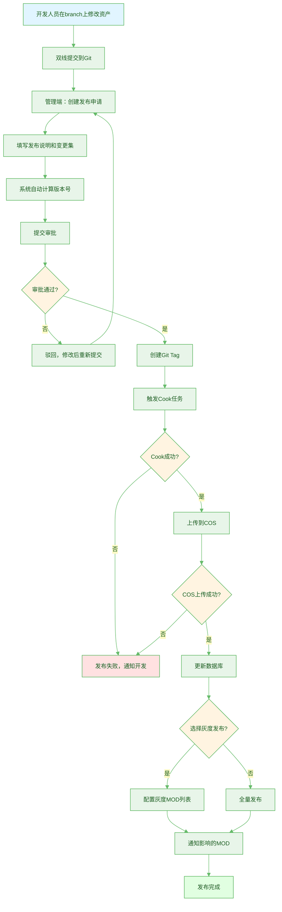
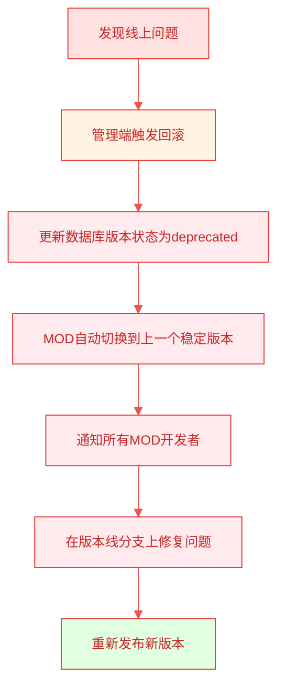
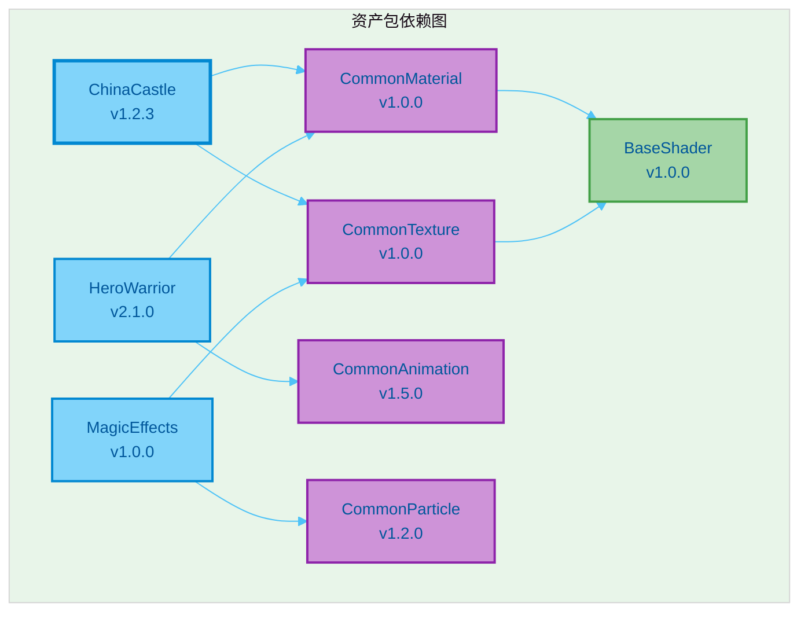
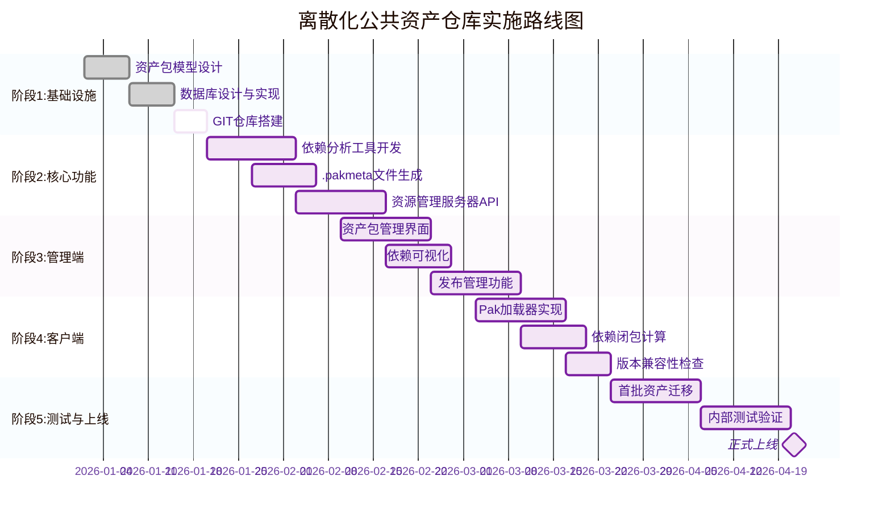

# 离散化公共资产仓库技术方案

**文档版本**: v1.0  
**最后更新**: 2026-01-10  
**基于**: 元梦之星平台化基础架构 + UE4 PAK资源管理技术方案  
**状态**: 设计完成，待实施  
**整合文档**: 发布流程设计 + MountPoint注册管理功能设计

---

## 目录

1. [核心目标与设计理念](#1-核心目标与设计理念)
2. [资产组织模型](#2-资产组织模型)
3. [版本管理与Git策略](#3-版本管理与git策略)
4. [核心工作流程](#4-核心工作流程)
5. [依赖管理方案](#5-依赖管理方案)
6. [COS存储结构](#6-cos存储结构)
7. [数据库设计](#7-数据库设计)
8. [管理端功能设计](#8-管理端功能设计)
9. [资源管理服务器API接口设计](#9-资源管理服务器api接口设计)
10. [关键技术问题与解决方案](#10-关键技术问题与解决方案)
11. [实施路线图](#11-实施路线图)
12. [风险与应对](#12-风险与应对)
13. [总结](#13-总结)

---

## 核心决策摘要

本文档整合了多轮讨论的技术决策，以下是关键决策点：

### 技术架构决策
1. ✅ **资产包粒度**：每个资产包（如HeroWarrior、NPCVillager）是独立Pak，而非整个Scene或Character一个Pak
2. ✅ **MountPoint策略**：统一到一级目录（/AssetRepo/Scene/），不为每个Pak定义独立MountPoint
3. ✅ **Pak命名规则**：`{PakName}_{MD5}.pak`，MD5为Cook后Pak文件的完整哈希值
4. ✅ **pakmeta存储**：在构建时与其他资源文件一起打包进Pak，作为Pak的普通文件存在

### 版本管理决策
1. ✅ **分支策略**：develop分支 + 版本线分支（branch_v1.x.0）+ Tag（tag_v1.x.x）
2. ✅ **双线提交**：每次修改产生2个commit，分别提交到版本线分支和develop分支
3. ✅ **Tag发布**：使用者只能引用Tag版本，不能引用分支
4. ✅ **版本升级**：发布时才升级版本号，而非每次修改都升级

### Git权限决策
1. ✅ **集中管理**：所有Git操作必须通过管理端执行
2. ✅ **权限控制**：普通用户无直接Git权限，仅通过管理端提交
3. ✅ **操作审计**：所有Git操作记录日志，便于追溯

### 发布流程决策
1. ✅ **发布审批**：发布需要审批流程
2. ✅ **COS上传**：上传成功是发布的必要条件，失败则不能发布
3. ✅ **灰度发布**：支持选择性MOD灰度验证
4. ✅ **环境隔离**：COS按环境（test/prod/dev）和Tag版本组织

### MOD集成决策
1. ✅ **Manifest管理**：MOD Manifest在管理端填写，支持JSON导入
2. ✅ **自动生成**：管理端根据公仓版本自动生成完整Manifest（包含MD5和依赖）
3. ✅ **版本兼容性**：APP大版本强制升级，运营期间智能提醒依赖变更的MOD

### 平台适配决策
1. ✅ **平台隔离**：不同平台Cook结果不一致，COS按平台分级存储
2. ✅ **GUID用途**：GUID仅作为资源管理服务器内部使用，不出现在COS路径中

---

## 1. 核心目标与设计理念

### 1.1 核心目标

建立以**资产包(Asset Package)**为基本单元的离散化公共资产仓库,实现:

1. **真正的跨MOD资源共享**: 公共资产只维护一份,所有MOD通过引用使用
2. **细粒度的资源管理**: 以资产包为单位进行版本管理、依赖管理和发布
3. **按需下载**: MOD只下载实际使用的资产包,避免"为少量资源拉整包"
4. **统一的资产治理**: 通过资源管理服务器实现全生命周期管理

### 1.2 设计理念

- **资产包优先**: 按资产包(如ChinaCastle、ModernCity、HeroWarrior)组织,而非按资源类型(Material/StaticMesh)
- **小Pak + 全替换**: 每个资产包是一个独立Pak(如HeroWarrior.pak、NPCVillager.pak),更新时整包替换而非差量Patch
- **统一MountPoint**: 按分类统一挂载点(如/AssetRepo/Scene、/AssetRepo/Character),而非每个Pak独立MountPoint
- **Meta文件管理依赖**: 依赖信息存储在.pakmeta文件中,在构建时与其他资源文件一起打包进Pak,作为Pak的普通文件存在
- **双线提交模式**: 每次资产修改产生2个commit,分别提交到版本线分支和develop分支,确保修改同步
- **Tag版本管理**: 使用者只能引用不可变的Tag版本,而非分支,确保版本稳定性
- **Git权限集中管理**: 所有Git操作必须通过管理端执行,普通用户无直接Git权限

---

## 2. 资产组织模型

### 2.1 资产包分类维度



### 2.2 资产包目录结构示例

```
/AssetRepo                                    # 公共资产仓库根目录
├── /Scene                                    # 场景类资产包
│   ├── /ChinaCastle                         # 中国城堡资产包
│   │   ├── /StaticMesh                      # 静态网格体
│   │   │   ├── SM_Castle_Wall_01.uasset
│   │   │   ├── SM_Castle_Tower_01.uasset
│   │   │   └── SM_Castle_Gate_01.uasset
│   │   ├── /Material                        # 材质
│   │   │   ├── M_Castle_Stone.uasset
│   │   │   ├── M_Castle_Wood.uasset
│   │   │   └── M_Castle_Roof.uasset
│   │   ├── /Texture                         # 纹理
│   │   │   ├── T_Castle_Stone_D.uasset
│   │   │   ├── T_Castle_Stone_N.uasset
│   │   │   ├── T_Castle_Wood_D.uasset
│   │   │   └── T_Castle_Wood_N.uasset
│   │   ├── /Blueprint                       # 蓝图
│   │   │   └── BP_Castle_Interactive.uasset
│   │   └── ChinaCastle.pakmeta             # 资产包元数据文件
│   │
│   └── /ModernCity                          # 现代城市资产包
│       ├── /StaticMesh
│       ├── /Material
│       ├── /Texture
│       └── ModernCity.pakmeta
│
├── /Character                                # 角色类资产包
│   ├── /HeroWarrior                         # 战士英雄资产包
│   │   ├── /SkeletalMesh
│   │   │   └── SK_Warrior.uasset
│   │   ├── /Animation
│   │   │   ├── Anim_Warrior_Idle.uasset
│   │   │   ├── Anim_Warrior_Run.uasset
│   │   │   └── Anim_Warrior_Attack.uasset
│   │   ├── /Material
│   │   │   └── M_Warrior_Skin.uasset
│   │   ├── /Texture
│   │   │   ├── T_Warrior_D.uasset
│   │   │   └── T_Warrior_N.uasset
│   │   └── HeroWarrior.pakmeta
│   │
│   └── /NPCVillager                         # 村民NPC资产包
│       ├── /SkeletalMesh
│       ├── /Animation
│       ├── /Material
│       └── NPCVillager.pakmeta
│
├── /Effect                                   # 特效类资产包
│   ├── /MagicEffects                        # 魔法特效包
│   │   ├── /Particle
│   │   ├── /Material
│   │   ├── /Texture
│   │   └── MagicEffects.pakmeta
│   │
│   └── /WeatherFX                           # 天气特效包
│       ├── /Particle
│       ├── /Material
│       └── WeatherFX.pakmeta
│
└── /Audio                                    # 音频类资产包
    ├── /BGMCollection                       # 背景音乐包
    │   ├── BGM_Battle_01.uasset
    │   ├── BGM_Peaceful_01.uasset
    │   └── BGMCollection.pakmeta
    │
    └── /SFXPack                             # 音效包
        ├── SFX_Footstep.uasset
        ├── SFX_Sword_Swing.uasset
        └── SFXPack.pakmeta
```

### 2.3 资产包元数据文件格式(.pakmeta)

```json
{
  "pakGUID": "550e8400-e29b-41d4-a716-446655440000",
  "pakName": "ChinaCastle",
  "pakMD5": "a3f5e8d9c2b1f4e6a7d8c9b0e1f2a3b4",
  "version": "v1.2.3",
  "category": "Scene",
  "mountPoint": "/AssetRepo/Scene/",
  "description": "中国风城堡场景资产包，包含城墙、塔楼、大门等建筑元素",
  "tags": ["Scene", "Castle", "Chinese", "Architecture"],
  "platforms": ["Win64", "Android", "iOS"],
  "totalSize": 52428800,
  "assetCount": 45,
  "createdBy": "zhangsan",
  "createdAt": "2026-01-05 14:00:00",
  "updatedAt": "2026-01-10 10:00:00",
  "changeLog": "优化LOD层级，减少面数30%",
  "dependencies": [
    {
      "pakName": "CommonMaterial",
      "pakMD5": "b2c4d6e8f0a1c3e5d7f9b1a3c5e7d9f1",
      "minVersion": "v1.0.0",
      "reason": "依赖通用石材和木材材质"
    },
    {
      "pakName": "CommonTexture",
      "pakMD5": "c3d5e7f9a1b3c5d7e9f1a3b5c7d9e1f3",
      "minVersion": "v1.0.0",
      "reason": "依赖通用纹理库"
    }
  ],
  "assets": [
    {
      "path": "/AssetRepo/Scene/ChinaCastle/StaticMesh/SM_Castle_Wall_01",
      "type": "StaticMesh",
      "size": 2097152
    },
    {
      "path": "/AssetRepo/Scene/ChinaCastle/Material/M_Castle_Stone",
      "type": "Material",
      "size": 524288
    }
  ]
}
```

**关键字段说明**:
- `pakMD5`: Cook后Pak文件的MD5值,用于文件命名和依赖标识
- `mountPoint`: 统一到分类级别(如/AssetRepo/Scene/),而非每个Pak独立路径
- `dependencies[].pakMD5`: 依赖的Pak的MD5值,用于精确定位依赖版本

**存储方式**:
- .pakmeta文件在构建时与其他资源文件(uasset等)一起打包进Pak
- 作为Pak的普通文件存在,可以像读取其他资源一样读取
- 优势: 结构清晰、易于编辑、支持版本控制、工具友好

---

## 3. 版本管理与Git策略

### 3.1 Git权限控制

#### 核心原则
- **所有Git操作必须通过管理端**：管理端后台执行Git命令
- **普通用户无直接Git权限**：不允许直接push、merge等操作
- **权限分级**：
  - 普通开发者：通过管理端提交资产修改申请
  - 审批人：通过管理端审批发布
  - 系统管理员：管理端后台拥有Git完整权限

#### 管理端Git操作封装
```python
class GitOperationService:
    """
    管理端Git操作服务，封装所有Git命令
    """
    
    def create_branch(self, base_branch, new_branch, operator):
        """创建版本线分支"""
        if not self.check_permission(operator, 'create_branch'):
            raise PermissionError("无权限创建分支")
        
        subprocess.run(['git', 'checkout', base_branch])
        subprocess.run(['git', 'pull'])
        subprocess.run(['git', 'checkout', '-b', new_branch])
        subprocess.run(['git', 'push', 'origin', new_branch])
        
        self.log_operation('create_branch', operator, new_branch)
    
    def create_tag(self, branch, tag_name, operator):
        """创建发布Tag"""
        if not self.check_permission(operator, 'create_tag'):
            raise PermissionError("无权限创建Tag")
        
        subprocess.run(['git', 'checkout', branch])
        subprocess.run(['git', 'tag', tag_name])
        subprocess.run(['git', 'push', 'origin', tag_name])
        
        self.log_operation('create_tag', operator, tag_name)
    
    def dual_commit(self, branch, files, commit_message, operator):
        """双线提交：同时提交到版本线分支和develop"""
        if not self.check_permission(operator, 'commit'):
            raise PermissionError("无权限提交代码")
        
        commits = []
        
        # 1. 提交到版本线分支
        subprocess.run(['git', 'checkout', branch])
        subprocess.run(['git', 'add'] + files)
        subprocess.run(['git', 'commit', '-m', commit_message])
        branch_commit = self.get_last_commit_hash()
        subprocess.run(['git', 'push', 'origin', branch])
        commits.append({'branch': branch, 'commit': branch_commit})
        
        # 2. 同步提交到develop分支
        subprocess.run(['git', 'checkout', 'develop'])
        subprocess.run(['git', 'add'] + files)
        subprocess.run(['git', 'commit', '-m', commit_message])
        develop_commit = self.get_last_commit_hash()
        subprocess.run(['git', 'push', 'origin', 'develop'])
        commits.append({'branch': 'develop', 'commit': develop_commit})
        
        # 3. 记录操作日志
        self.log_operation('dual_commit', operator, commits)
        
        return commits
```

### 3.2 分支与Tag策略

#### 核心原则
- **develop分支**：主开发分支，持续迭代，不对外发布
- **版本线分支**：从develop拉出，作为已发布版本的修复分支，发布后保留
- **Tag**：不可变的发布快照，MOD只能引用Tag

#### 版本演进示例
```
develop (主开发分支)
    ↓ 拉出版本线
branch_v1.0.0
    ↓ 首次发布
tag_v1.0.0
    ↓ 修改资产A、B、C
tag_v1.0.1
    ↓ 修改资产G、H、J、K
tag_v1.0.2
    ↓ 同步所有修改到develop
develop (包含v1.0.x所有修复)
    ↓ 拉出新版本线
branch_v1.1.0
    ↓ 首次发布
tag_v1.1.0
```

#### 为什么新大版本必须从develop拉出？
- **序列化兼容性**：随着引擎升级，资产序列化格式可能发生变化
- **技术债务清理**：develop分支包含所有历史修复和优化
- **架构演进**：新版本可能需要重构资产组织结构

#### 分支生命周期
- **版本线分支永久保留**：用于历史版本的问题修复和回溯
- **develop分支持续演进**：作为所有新版本的基准

### 3.3 版本号规则

#### 语义化版本号
```
v{主版本}.{次版本}.{修订版本}

示例：v1.0.3
```

#### 版本升级规则
| 版本类型 | 升级条件 | 示例 |
|---------|---------|------|
| **主版本** | 不兼容的资产修改（如材质系统重构） | v1.0.3 → v2.0.0 |
| **次版本** | 向下兼容的功能性新增（如新增资产包） | v1.0.3 → v1.1.0 |
| **修订版本** | 向下兼容的问题修正（如材质bug修复） | v1.0.3 → v1.0.4 |

#### 管理端校验规则
- ✅ 版本号必须递增
- ✅ 主版本升级必须从develop拉出新分支
- ✅ 次版本和修订版本在版本线分支上发布
- ✅ 修改必须同步回develop（双线提交）

---

## 4. 核心工作流程

### 4.1 资产入库流程



### 4.2 资产修改与发布流程

#### 完整发布流程图


#### 阶段1：资产修改（双线提交）
**执行者**：美术/技术人员通过管理端上传  
**核心机制**：每次资产修改产生2个commit，分别提交到版本线分支和develop分支

**操作流程**：
```bash
# 管理端自动执行双线提交
# 1. 提交到版本线分支
git checkout branch_v1.0.0
git add AssetRepo/Scene/ChinaCastle/*
git commit -m "fix: 修复ChinaCastle材质显示问题"
git push origin branch_v1.0.0

# 2. 同步提交到develop分支
git checkout develop
git add AssetRepo/Scene/ChinaCastle/*
git commit -m "fix: 修复ChinaCastle材质显示问题"
git push origin develop
```

**管理端界面提示**：
```
┌─────────────────────────────────────────┐
│  资产提交确认                           │
├─────────────────────────────────────────┤
│  修改资产: ChinaCastle                  │
│  提交信息: 修复材质显示问题             │
│                                         │
│  ✓ 将提交到 branch_v1.0.0               │
│  ✓ 将同步提交到 develop                 │
│                                         │
│  ⚠️ 注意：将产生2个commit               │
│                                         │
│  [确认提交]  [取消]                     │
└─────────────────────────────────────────┘
```

#### 阶段2：创建发布申请
**执行者**：管理员  
**操作**：
1. 选择要发布的资产包
2. 填写版本号和变更说明
3. 选择目标环境（dev/test/prod）
4. 选择是否灰度发布
5. 提交审批

#### 阶段3：Cook并上传COS
**执行者**：构建服务器  
**操作**：
```bash
# 1. Cook资产（pakmeta文件会和其他资源一起打包进Pak）
RunUAT BuildCookRun \
  -project=AssetRepo \
  -platform=iOS+Android+Windows \
  -cook -pak

# 2. 计算MD5并重命名
for pak in *.pak; do
  md5=$(md5sum $pak | cut -d' ' -f1)
  mv $pak ${pak%.pak}_${md5}.pak
done

# 3. 上传到COS（按Tag版本组织）
for platform in iOS Android Windows; do
  cos_path="/prod/tag_v1.0.3/${platform}/"
  upload_to_cos $cos_path *.pak
done
```

**COS上传结果**：
```
/prod/tag_v1.0.3/iOS/ChinaCastle_a3f5e8d9c2b1f4e6.pak (包含pakmeta)
/prod/tag_v1.0.3/iOS/HeroWarrior_b7c8d9e0f1a2b3c4.pak (包含pakmeta)
/prod/tag_v1.0.3/Android/ChinaCastle_b2c3d4e5f6a7b8c9.pak
/prod/tag_v1.0.3/Android/HeroWarrior_c3d4e5f6a7b8c9d0.pak
...
```

#### 阶段4：灰度发布（可选）
**决策者**：发布人在创建发布申请时选择

**灰度流程**：
1. 选择灰度MOD列表（如选择2-5个MOD进行灰度）
2. 灰度MOD使用新版本，其他MOD使用旧版本
3. 监控灰度MOD的崩溃率、加载时间等指标
4. 验证通过后扩大灰度范围或全量发布
5. 发现问题可快速回滚灰度MOD

**灰度配置示例**：
```sql
-- 版本表中的灰度字段
UPDATE asset_repo_versions
SET is_gray_release = TRUE,
    gray_mod_list = '["mod_12345", "mod_67890"]'
WHERE version = 'v1.0.3';
```

#### 阶段5：通知影响的MOD
**通知内容**：
```
【公共资产仓库更新通知】

版本: v1.0.3
发布时间: 2026-01-10 19:00:00

变更资产:
• ChinaCastle - 修复材质透明度问题
• HeroWarrior - 优化性能

您的MOD "城堡大冒险" 引用了以下变更资产:
• ChinaCastle (当前使用v1.0.2)

建议操作:
1. 在测试环境验证新版本兼容性
2. 更新MOD的publicRepoVersion为1.0.3
3. 重新发布MOD

查看详情: https://manage.example.com/versions/v1.0.3
```

### 4.3 MOD发布集成

#### MOD Manifest配置（管理端填写）
**操作界面**：
```
┌─────────────────────────────────────────┐
│  MOD发布配置                             │
├─────────────────────────────────────────┤
│  MOD ID: mod_12345                      │
│  MOD名称: 城堡大冒险                     │
│                                         │
│  公仓版本: v1.0.3  [选择版本]           │
│                                         │
│  引用资产:                              │
│  ┌─────────────────────────────────┐   │
│  │ ☑ ChinaCastle                   │   │
│  │ ☑ HeroWarrior                   │   │
│  │ ☐ NPCVillager                   │   │
│  └─────────────────────────────────┘   │
│                                         │
│  [导入JSON]  [生成Manifest]  [发布]    │
└─────────────────────────────────────────┘
```

**JSON导入格式**：
```json
{
    "modId": "mod_12345",
    "modName": "城堡大冒险",
    "publicRepoVersion": "1.0.3",
    "assets": ["ChinaCastle", "HeroWarrior"]
}
```

#### 管理端生成最终Manifest
**生成逻辑**：
1. 根据publicRepoVersion查询数据库获取资产快照
2. 解析每个资产的MD5、COS路径和依赖关系
3. 计算完整的依赖闭包
4. 生成完整的Manifest文件

**最终Manifest**：
```json
{
    "modId": "mod_12345",
    "modName": "城堡大冒险",
    "publicRepoVersion": "1.0.3",
    "assets": [
        {
            "pak": "ChinaCastle",
            "md5": "a3f5e8d9c2b1f4e6",
            "cosPath": "/prod/tag_v1.0.3/iOS/ChinaCastle_a3f5e8d9c2b1f4e6.pak",
            "dependencies": [
                {"pak": "CommonMaterial", "md5": "c1d2e3f4a5b6c7d8"}
            ]
        },
        {
            "pak": "HeroWarrior",
            "md5": "b7c8d9e0f1a2b3c4",
            "cosPath": "/prod/tag_v1.0.3/iOS/HeroWarrior_b7c8d9e0f1a2b3c4.pak",
            "dependencies": []
        }
    ]
}
```

### 4.4 版本兼容性检查

#### 核心策略
1. **APP大版本发布时**：强制所有MOD升级到最新公仓版本
2. **大版本运营期间**：
   - 提醒依赖到修改Pak的MOD评估升级
   - 未依赖修改Pak的MOD可以"过时但兼容"，无副作用

#### 检查逻辑
```python
def check_version_compatibility(mod_version, current_version, app_version_type, mod_dependencies):
    """
    检查MOD使用的公仓版本是否兼容
    """
    mod_major, mod_minor, mod_patch = parse_version(mod_version)
    cur_major, cur_minor, cur_patch = parse_version(current_version)
    
    # 主版本不同，不兼容
    if mod_major != cur_major:
        return {
            "compatible": False,
            "level": "major_breaking",
            "message": f"主版本不兼容，必须升级到v{cur_major}.x.x",
            "action": "force_upgrade"
        }
    
    # APP大版本发布时，强制升级
    if app_version_type == "major_release" and mod_version != current_version:
        return {
            "compatible": False,
            "level": "app_major_release",
            "message": f"APP大版本发布，必须升级到v{current_version}",
            "action": "force_upgrade"
        }
    
    # 大版本运营期间
    if mod_version != current_version:
        # 检查MOD依赖的Pak是否有变更
        changed_paks = get_changed_paks_between_versions(mod_version, current_version)
        affected_paks = set(mod_dependencies) & set(changed_paks)
        
        if affected_paks:
            return {
                "compatible": True,
                "level": "dependency_changed",
                "message": f"依赖的资产包已更新：{', '.join(affected_paks)}，建议升级",
                "action": "recommend_upgrade",
                "affectedPaks": list(affected_paks)
            }
        else:
            return {
                "compatible": True,
                "level": "outdated_but_compatible",
                "message": "依赖资产未变更，可继续使用",
                "action": "optional_upgrade"
            }
    
    return {"compatible": True, "level": "up_to_date", "action": "none"}
```

### 4.5 回滚机制

#### 回滚场景
| 场景 | 回滚策略 | 操作 |
|-----|---------|------|
| **Cook失败** | 不创建Tag，发布失败 | 修复问题后重新发布 |
| **COS上传失败** | 删除Tag，发布失败 | 修复网络问题后重新发布 |
| **灰度验证失败** | 回滚灰度MOD配置 | 灰度MOD使用上一个稳定版本 |
| **线上问题** | 回滚COS，修复分支 | 1. COS切换到上一个Tag<br>2. 修复分支后重新发布 |

#### 回滚操作流程


---

## 5. 依赖管理方案

### 5.1 依赖信息存储方案

**核心设计**: 使用独立的`.pakmeta`文件存储依赖信息,与资产一起打包到Pak中

```
ChinaCastle_a3f5e8d9c2b1f4e6a7d8c9b0e1f2a3b4.pak 文件结构:
├── [Pak Header]
├── [Asset Data]
│   ├── ChinaCastle/StaticMesh/SM_Castle_Wall_01.uasset
│   ├── ChinaCastle/Material/M_Castle_Stone.uasset
│   ├── ChinaCastle/Texture/T_Castle_Stone_D.uasset
│   └── ...
├── [Metadata]
│   └── ChinaCastle.pakmeta              # 依赖信息文件
└── [Pak Index]
```

**命名规则**: `{PakName}_{MD5}.pak`
- PakName: 资产包名称(如ChinaCastle、HeroWarrior)
- MD5: Cook后Pak文件的MD5值(32位小写十六进制)

**优势**:
1. **结构清晰**: meta文件是标准JSON格式,易于编辑和版本控制
2. **工具友好**: 可以在打包前修改meta文件,无需重新Cook资产
3. **独立管理**: meta文件可以单独提取、查看和验证
4. **版本控制**: meta文件可以纳入GIT版本管理

### 5.2 依赖闭包计算

```cpp
// 伪代码：依赖闭包计算
class FPakDependencyResolver {
public:
    struct FPakMetadata {
        FString PakGUID;
        FString PakName;
        FString Version;
        FString MountPoint;
        TArray<FDependencyEntry> Dependencies;
    };
    
    struct FDependencyEntry {
        FString PakName;      // 依赖的Pak名称
        FString PakMD5;       // 依赖的Pak的MD5值
        FString MinVersion;   // 最低版本要求
        FString Reason;       // 依赖原因
    };
    
    // 从Pak中读取meta文件
    bool LoadMetadataFromPak(const FString& PakFilePath, FPakMetadata& OutMetadata) {
        FPakFile PakFile(*PakFilePath);
        if (!PakFile.IsValid()) {
            return false;
        }
        
        // 查找.pakmeta文件
        FString MetaFileName = FPaths::GetBaseFilename(PakFilePath) + TEXT(".pakmeta");
        const FPakEntry* MetaEntry = PakFile.Find(*MetaFileName);
        
        if (!MetaEntry) {
            UE_LOG(LogPak, Warning, TEXT("No .pakmeta file found in pak: %s"), *PakFilePath);
            return false;
        }
        
        // 读取meta文件内容
        TArray<uint8> MetaData;
        MetaData.SetNum(MetaEntry->Size);
        PakFile.Read(MetaData.GetData(), MetaEntry->Offset, MetaEntry->Size);
        
        // 解析JSON
        FString JsonString = FString(UTF8_TO_TCHAR(MetaData.GetData()));
        TSharedPtr<FJsonObject> JsonObject;
        TSharedRef<TJsonReader<>> Reader = TJsonReaderFactory<>::Create(JsonString);
        
        if (!FJsonSerializer::Deserialize(Reader, JsonObject)) {
            return false;
        }
        
        // 提取元数据
        OutMetadata.PakGUID = JsonObject->GetStringField(TEXT("pakGUID"));
        OutMetadata.PakName = JsonObject->GetStringField(TEXT("pakName"));
        OutMetadata.Version = JsonObject->GetStringField(TEXT("version"));
        OutMetadata.MountPoint = JsonObject->GetStringField(TEXT("mountPoint"));
        
        // 提取依赖列表
        const TArray<TSharedPtr<FJsonValue>>* DepsArray;
        if (JsonObject->TryGetArrayField(TEXT("dependencies"), DepsArray)) {
            for (const TSharedPtr<FJsonValue>& DepValue : *DepsArray) {
                TSharedPtr<FJsonObject> DepObj = DepValue->AsObject();
                
                FDependencyEntry Dep;
                Dep.PakName = DepObj->GetStringField(TEXT("pakName"));
                Dep.PakMD5 = DepObj->GetStringField(TEXT("pakMD5"));
                Dep.MinVersion = DepObj->GetStringField(TEXT("minVersion"));
                Dep.Reason = DepObj->GetStringField(TEXT("reason"));
                
                OutMetadata.Dependencies.Add(Dep);
            }
        }
        
        return true;
    }
    
    // 计算依赖闭包
    TArray<FString> ComputeDependencyClosure(const FString& RootPakGUID) {
        TArray<FString> Closure;
        TSet<FString> Visited;
        TQueue<FString> Queue;
        
        Queue.Enqueue(RootPakGUID);
        Visited.Add(RootPakGUID);
        
        while (!Queue.IsEmpty()) {
            FString CurrentGUID;
            Queue.Dequeue(CurrentGUID);
            
            Closure.Add(CurrentGUID);
            
            // 获取当前Pak的元数据
            FPakMetadata Metadata;
            if (!GetMetadataByGUID(CurrentGUID, Metadata)) {
                continue;
            }
            
            // 遍历依赖
            for (const FDependencyEntry& Dep : Metadata.Dependencies) {
                // 通过PakName+MD5查找依赖的GUID
                FString DepGUID = GetGUIDByNameAndMD5(Dep.PakName, Dep.PakMD5);
                if (!DepGUID.IsEmpty() && !Visited.Contains(DepGUID)) {
                    Queue.Enqueue(DepGUID);
                    Visited.Add(DepGUID);
                }
            }
        }
        
        return Closure;
    }
    
    // 检测循环依赖
    bool DetectCircularDependency(const FString& RootPakGUID, TArray<FString>& OutCycle) {
        TSet<FString> Visited;
        TArray<FString> Path;
        
        return DFSDetectCycle(RootPakGUID, Visited, Path, OutCycle);
    }
    
private:
    bool DFSDetectCycle(
        const FString& CurrentGUID,
        TSet<FString>& Visited,
        TArray<FString>& Path,
        TArray<FString>& OutCycle
    ) {
        if (Path.Contains(CurrentGUID)) {
            // 找到循环
            int32 CycleStart = Path.Find(CurrentGUID);
            OutCycle = TArray<FString>(Path.GetData() + CycleStart, Path.Num() - CycleStart);
            OutCycle.Add(CurrentGUID);
            return true;
        }
        
        if (Visited.Contains(CurrentGUID)) {
            return false;
        }
        
        Visited.Add(CurrentGUID);
        Path.Add(CurrentGUID);
        
        FPakMetadata Metadata;
        if (GetMetadataByGUID(CurrentGUID, Metadata)) {
            for (const FDependencyEntry& Dep : Metadata.Dependencies) {
                // 通过PakName+MD5查找依赖的GUID
                FString DepGUID = GetGUIDByNameAndMD5(Dep.PakName, Dep.PakMD5);
                if (!DepGUID.IsEmpty() && DFSDetectCycle(DepGUID, Visited, Path, OutCycle)) {
                    return true;
                }
            }
        }
        
        Path.RemoveAt(Path.Num() - 1);
        return false;
    }
};
```

### 5.3 客户端加载逻辑

```cpp
// 伪代码：客户端Pak加载器
class FAssetRepoPakLoader {
public:
    // 加载MOD所需的所有Pak
    bool LoadPaksForMOD(const FString& MODID) {
        // 1. 从服务器获取MOD的Pak清单
        TArray<FString> RequiredPakGUIDs = FetchPakListForMOD(MODID);
        
        // 2. 计算完整的依赖闭包
        TSet<FString> AllPakGUIDs;
        for (const FString& PakGUID : RequiredPakGUIDs) {
            TArray<FString> Closure = DependencyResolver.ComputeDependencyClosure(PakGUID);
            AllPakGUIDs.Append(Closure);
        }
        
        // 3. 拓扑排序(确保依赖先加载)
        TArray<FString> SortedPakGUIDs = TopologicalSort(AllPakGUIDs);
        
        // 4. 按顺序加载Pak
        for (const FString& PakGUID : SortedPakGUIDs) {
            if (!LoadSinglePak(PakGUID)) {
                UE_LOG(LogPak, Error, TEXT("Failed to load pak: %s"), *PakGUID);
                return false;
            }
        }
        
        return true;
    }
    
private:
    bool LoadSinglePak(const FString& PakGUID) {
        // 1. 获取Pak元数据
        FPakMetadata Metadata;
        if (!DependencyResolver.GetMetadataByGUID(PakGUID, Metadata)) {
            return false;
        }
        
        // 2. 检查是否已加载
        if (LoadedPaks.Contains(PakGUID)) {
            UE_LOG(LogPak, Log, TEXT("Pak already loaded: %s"), *Metadata.PakName);
            return true;
        }
        
        // 3. 构建Pak文件路径
        FString PakFilePath = ConstructPakPath(Metadata.PakName, Metadata.Version);
        
        // 4. 挂载Pak
        FPakPlatformFile* PakPlatform = GetPakPlatformFile();
        if (PakPlatform) {
            if (PakPlatform->Mount(*PakFilePath, 0, *Metadata.MountPoint)) {
                LoadedPaks.Add(PakGUID);
                UE_LOG(LogPak, Log, TEXT("Mounted pak: %s at %s"), 
                    *Metadata.PakName, *Metadata.MountPoint);
                return true;
            }
        }
        
        return false;
    }
    
    TArray<FString> TopologicalSort(const TSet<FString>& PakGUIDs) {
        TArray<FString> Result;
        TSet<FString> Visited;
        TSet<FString> InStack;
        
        for (const FString& GUID : PakGUIDs) {
            if (!Visited.Contains(GUID)) {
                TopologicalSortDFS(GUID, Visited, InStack, Result);
            }
        }
        
        Algo::Reverse(Result);
        return Result;
    }
    
    void TopologicalSortDFS(
        const FString& GUID,
        TSet<FString>& Visited,
        TSet<FString>& InStack,
        TArray<FString>& Result
    ) {
        Visited.Add(GUID);
        InStack.Add(GUID);
        
        FPakMetadata Metadata;
        if (DependencyResolver.GetMetadataByGUID(GUID, Metadata)) {
            for (const FDependencyEntry& Dep : Metadata.Dependencies) {
                // 通过PakName+MD5查找依赖的GUID
                FString DepGUID = DependencyResolver.GetGUIDByNameAndMD5(Dep.PakName, Dep.PakMD5);
                if (!DepGUID.IsEmpty() && !Visited.Contains(DepGUID)) {
                    TopologicalSortDFS(DepGUID, Visited, InStack, Result);
                }
            }
        }
        
        InStack.Remove(GUID);
        Result.Add(GUID);
    }
    
    FPakDependencyResolver DependencyResolver;
    TSet<FString> LoadedPaks;
};
```

---

## 6. COS存储结构

### 6.1 目录组织

**核心原则**: 按环境和平台隔离,使用Tag版本号组织目录

```
/COS_Bucket_AssetRepo
├── /prod                                    # 线上环境
│   ├── /tag_v1.0.3                         # Tag版本目录
│   │   ├── /Win64
│   │   │   ├── ChinaCastle_a3f5e8d9c2b1f4e6.pak
│   │   │   ├── HeroWarrior_b7c8d9e0f1a2b3c4.pak
│   │   │   └── ...
│   │   ├── /Android
│   │   │   ├── ChinaCastle_b2c3d4e5f6a7b8c9.pak
│   │   │   └── ...
│   │   └── /iOS
│   │       ├── ChinaCastle_c3d4e5f6a7b8c9d0.pak
│   │       └── ...
│   ├── /tag_v1.0.4
│   │   ├── /Win64
│   │   ├── /Android
│   │   └── /iOS
│   └── ...
├── /test                                    # 测试环境
│   ├── /tag_v1.1.0-beta
│   │   ├── /Win64
│   │   ├── /Android
│   │   └── /iOS
│   └── ...
└── /dev                                     # 开发环境
    ├── /tag_v1.2.0-alpha
    │   ├── /Win64
    │   ├── /Android
    │   └── /iOS
    └── ...
```

**命名规则说明**:
- Pak文件: `{PakName}_{MD5}.pak`
- pakmeta已打包在Pak内部,不再单独存储
- MD5值为Cook后Pak文件的完整MD5哈希(32位小写十六进制)
- 目录按Tag版本组织,便于版本管理和回滚

**设计优势**:
1. **版本隔离**: 不同Tag版本完全隔离,互不影响
2. **回滚简单**: 切换Tag即可回滚到历史版本
3. **并行发布**: 可以同时维护多个版本(如v1.0.x和v1.1.x)
4. **存储优化**: 相同MD5的Pak在不同Tag间可以共享(通过CDN缓存)

### 6.2 下载URL示例

```
# Pak文件
https://cos.example.com/AssetRepo/prod/tag_v1.0.3/Win64/ChinaCastle_a3f5e8d9c2b1f4e6.pak

# 不同平台的同一资产包
https://cos.example.com/AssetRepo/prod/tag_v1.0.3/Android/ChinaCastle_b2c3d4e5f6a7b8c9.pak
https://cos.example.com/AssetRepo/prod/tag_v1.0.3/iOS/ChinaCastle_c3d4e5f6a7b8c9d0.pak
```

**URL构建规则**:
```
{COS_BASE_URL}/{environment}/{tag_version}/{platform}/{PakName}_{MD5}.pak

参数说明:
- COS_BASE_URL: COS存储桶基础URL
- environment: 环境(prod/test/dev)
- tag_version: Tag版本号(如tag_v1.0.3)
- platform: 平台(Win64/Android/iOS/PC/Harmony/H5)
- PakName: 资产包名称
- MD5: Pak文件的MD5值(不同平台Cook结果不同,MD5也不同)
```

**平台差异说明**:
- 不同平台的Cook结果不一致,因此同一资产包在不同平台有不同的MD5
- GUID仅作为资源管理服务器内部使用,不出现在COS路径中
- 客户端根据自身平台自动选择对应的Pak文件

---

## 7. 数据库设计

### 7.1 核心表结构

#### 7.1.1 资产包表(asset_packages)

```sql
CREATE TABLE asset_packages (
    id BIGINT PRIMARY KEY AUTO_INCREMENT,
    pak_guid VARCHAR(64) UNIQUE NOT NULL COMMENT 'Pak全局唯一标识',
    pak_name VARCHAR(128) NOT NULL COMMENT '资产包名称',
    pak_md5 VARCHAR(32) NOT NULL COMMENT 'Pak文件MD5值',
    category VARCHAR(64) NOT NULL COMMENT '分类(Scene/Character/Effect/Audio)',
    version VARCHAR(32) NOT NULL COMMENT '版本号(v1.2.3)',
    mount_point VARCHAR(256) NOT NULL COMMENT '挂载点路径(统一到分类级别)',
    description TEXT COMMENT '描述',
    tags JSON COMMENT '标签数组',
    platforms JSON COMMENT '支持的平台',
    total_size BIGINT COMMENT '总大小(字节)',
    asset_count INT COMMENT '资产数量',
    created_by VARCHAR(64) COMMENT '创建人',
    created_at DATETIME DEFAULT CURRENT_TIMESTAMP,
    updated_at DATETIME DEFAULT CURRENT_TIMESTAMP ON UPDATE CURRENT_TIMESTAMP,
    change_log TEXT COMMENT '变更日志',
    status ENUM('draft', 'published', 'archived') DEFAULT 'draft',
    INDEX idx_pak_name (pak_name),
    INDEX idx_pak_md5 (pak_md5),
    INDEX idx_category (category),
    INDEX idx_version (version),
    INDEX idx_status (status),
    UNIQUE KEY uk_name_md5 (pak_name, pak_md5)
) COMMENT='资产包主表';
```

#### 7.1.2 依赖关系表(package_dependencies)

```sql
CREATE TABLE package_dependencies (
    id BIGINT PRIMARY KEY AUTO_INCREMENT,
    source_pak_guid VARCHAR(64) NOT NULL COMMENT '源Pak GUID',
    target_pak_guid VARCHAR(64) NOT NULL COMMENT '目标Pak GUID',
    target_pak_name VARCHAR(128) NOT NULL COMMENT '目标Pak名称',
    target_pak_md5 VARCHAR(32) NOT NULL COMMENT '目标Pak MD5值',
    min_version VARCHAR(32) NOT NULL COMMENT '最低版本要求',
    reason TEXT COMMENT '依赖原因',
    created_at DATETIME DEFAULT CURRENT_TIMESTAMP,
    UNIQUE KEY uk_dependency (source_pak_guid, target_pak_guid),
    INDEX idx_source (source_pak_guid),
    INDEX idx_target (target_pak_guid)
) COMMENT='资产包依赖关系表';
```

#### 7.1.3 资产清单表(package_assets)

```sql
CREATE TABLE package_assets (
    id BIGINT PRIMARY KEY AUTO_INCREMENT,
    pak_guid VARCHAR(64) NOT NULL COMMENT '所属Pak GUID',
    asset_path VARCHAR(512) NOT NULL COMMENT '资产路径',
    asset_type VARCHAR(64) NOT NULL COMMENT '资产类型',
    asset_size BIGINT COMMENT '资产大小(字节)',
    created_at DATETIME DEFAULT CURRENT_TIMESTAMP,
    INDEX idx_pak_guid (pak_guid),
    INDEX idx_asset_type (asset_type)
) COMMENT='资产包内资产清单';
```

#### 7.1.4 版本历史表(package_versions)

```sql
CREATE TABLE package_versions (
    id BIGINT PRIMARY KEY AUTO_INCREMENT,
    pak_guid VARCHAR(64) NOT NULL COMMENT 'Pak GUID',
    pak_name VARCHAR(128) NOT NULL COMMENT 'Pak名称',
    version VARCHAR(32) NOT NULL COMMENT '版本号',
    change_log TEXT COMMENT '变更日志',
    created_by VARCHAR(64) COMMENT '创建人',
    created_at DATETIME DEFAULT CURRENT_TIMESTAMP,
    git_tag VARCHAR(128) COMMENT 'Git Tag',
    INDEX idx_pak_guid (pak_guid),
    INDEX idx_version (version),
    INDEX idx_created_at (created_at)
) COMMENT='资产包版本历史';
```

#### 7.1.5 部署记录表(package_deployments)

```sql
CREATE TABLE package_deployments (
    id BIGINT PRIMARY KEY AUTO_INCREMENT,
    pak_guid VARCHAR(64) NOT NULL COMMENT 'Pak GUID',
    pak_name VARCHAR(128) NOT NULL COMMENT 'Pak名称',
    version VARCHAR(32) NOT NULL COMMENT '版本号',
    environment ENUM('dev', 'test', 'prod') NOT NULL COMMENT '环境',
    platform VARCHAR(32) NOT NULL COMMENT '平台',
    cos_path VARCHAR(512) NOT NULL COMMENT 'COS路径',
    deployed_by VARCHAR(64) COMMENT '部署人',
    deployed_at DATETIME DEFAULT CURRENT_TIMESTAMP,
    status ENUM('pending', 'success', 'failed') DEFAULT 'pending',
    INDEX idx_pak_guid (pak_guid),
    INDEX idx_environment (environment),
    INDEX idx_platform (platform),
    INDEX idx_deployed_at (deployed_at)
) COMMENT='资产包部署记录';
```

#### 7.1.6 MountPoint注册表(mount_points)

```sql
CREATE TABLE mount_points (
    id BIGINT PRIMARY KEY AUTO_INCREMENT,
    mount_point VARCHAR(256) UNIQUE NOT NULL COMMENT '挂载点路径(如/AssetRepo/Scene/)',
    category_name VARCHAR(64) UNIQUE NOT NULL COMMENT '分类名称(如Scene/Character)',
    display_name VARCHAR(128) NOT NULL COMMENT '显示名称(如场景资产/角色资产)',
    description TEXT COMMENT '分类描述',
    icon_url VARCHAR(512) COMMENT '分类图标URL',
    sort_order INT DEFAULT 0 COMMENT '排序权重',
    is_enabled TINYINT(1) DEFAULT 1 COMMENT '是否启用',
    created_by VARCHAR(64) COMMENT '创建人',
    created_at DATETIME DEFAULT CURRENT_TIMESTAMP,
    updated_at DATETIME DEFAULT CURRENT_TIMESTAMP ON UPDATE CURRENT_TIMESTAMP,
    INDEX idx_category_name (category_name),
    INDEX idx_sort_order (sort_order),
    INDEX idx_is_enabled (is_enabled)
) COMMENT='MountPoint一级分类注册表';
```

**预置数据示例**:
```sql
INSERT INTO mount_points (mount_point, category_name, display_name, description, sort_order) VALUES
('/AssetRepo/Scene/', 'Scene', '场景资产', '包含各类场景建筑、地形、植被等静态场景资产', 1),
('/AssetRepo/Character/', 'Character', '角色资产', '包含角色模型、动画、材质等角色相关资产', 2),
('/AssetRepo/Effect/', 'Effect', '特效资产', '包含粒子特效、Niagara系统、后处理特效等', 3),
('/AssetRepo/Audio/', 'Audio', '音频资产', '包含背景音乐、音效、语音等音频资源', 4),
('/AssetRepo/UI/', 'UI', 'UI资产', '包含UI贴图、字体、图标等界面资源', 5),
('/AssetRepo/Common/', 'Common', '通用资产', '包含通用材质、纹理、Shader等基础资源', 6);
```

---

## 8. 管理端功能设计

### 8.1 资产包管理

#### 8.1.1 资产包列表

```
┌─────────────────────────────────────────────────────────────┐
│  资产包管理                                                  │
├─────────────────────────────────────────────────────────────┤
│  [新建资产包]  [批量导入]  [导出清单]                       │
│                                                              │
│  筛选: 分类[全部▼] 状态[全部▼] 平台[全部▼] 搜索[____]      │
│                                                              │
│  资产包名称        分类      版本    大小    状态    操作    │
│  ─────────────────────────────────────────────────────────  │
│  ChinaCastle      Scene    v1.2.3   50MB   已发布  [详情]  │
│  ModernCity       Scene    v1.0.5   45MB   已发布  [详情]  │
│  HeroWarrior      Character v2.1.0  30MB   已发布  [详情]  │
│  NPCVillager      Character v1.5.0  25MB   草稿    [详情]  │
│  MagicEffects     Effect   v1.0.0   15MB   已发布  [详情]  │
│                                                              │
│  [上一页]  1 / 10  [下一页]                                 │
└─────────────────────────────────────────────────────────────┘
```

#### 8.1.2 资产包详情

```
┌─────────────────────────────────────────────────────────────┐
│  资产包详情 - ChinaCastle                                    │
├─────────────────────────────────────────────────────────────┤
│  基本信息:                                                   │
│  Pak GUID: 550e8400-e29b-41d4-a716-446655440000               │
│  Pak MD5: a3f5e8d9c2b1f4e6a7d8c9b0e1f2a3b4                 │
│  名称: ChinaCastle                                          │
│  分类: Scene                                                │
│  版本: v1.2.3                                               │
│  挂载点: /AssetRepo/Scene/                                  │
│  状态: 已发布                                               │
│                                                              │
│  描述:                                                       │
│  中国风城堡场景资产包，包含城墙、塔楼、大门等建筑元素        │
│                                                              │
│  标签: Scene, Castle, Chinese, Architecture                 │
│                                                              │
│  平台支持: Win64, Android, iOS                              │
│                                                              │
│  统计信息:                                                   │
│  总大小: 50 MB                                              │
│  资产数量: 45                                               │
│  创建人: zhangsan                                           │
│  创建时间: 2026-01-05 14:00:00                              │
│  更新时间: 2026-01-10 10:00:00                              │
│                                                              │
│  依赖关系:                                                   │
│  • CommonMaterial (v1.0.0+) - 依赖通用石材和木材材质        │
│  • CommonTexture (v1.0.0+) - 依赖通用纹理库                 │
│                                                              │
│  被引用情况:                                                 │
│  • MOD_Chase_001 (v1.0.0)                                   │
│  • MOD_Farm_002 (v2.1.0)                                    │
│                                                              │
│  [编辑]  [发布]  [查看依赖图]  [下载]                       │
└─────────────────────────────────────────────────────────────┘
```

### 8.2 依赖可视化



### 8.3 MountPoint分类管理

#### 8.3.1 功能概述

在离散化公共资产仓库系统中，**MountPoint（一级分类）注册管理**是基础设施的核心功能之一。它负责管理公共资产仓库的顶层分类结构，确保所有资产包都挂载到规范、统一的路径下。

**核心价值**:
1. **路径规范化**: 统一管理挂载点路径，避免路径混乱
2. **分类可扩展**: 支持动态添加新的资产分类，无需修改代码
3. **权限控制**: 通过管理端集中管理，防止随意创建分类
4. **数据完整性**: 确保分类与资产包的关联关系正确

**设计原则**:
- **统一挂载**: 同一分类下的所有资产包共享同一个MountPoint
- **路径不可变**: 一旦创建，MountPoint路径不可修改，保证稳定性
- **删除保护**: 有资产包的分类不允许删除，防止数据孤岛
- **自动生成**: MountPoint路径自动生成，格式为`/AssetRepo/{分类名称}/`

#### 8.3.2 数据库设计

**表结构**:
```sql
CREATE TABLE mount_points (
    id BIGINT PRIMARY KEY AUTO_INCREMENT,
    mount_point VARCHAR(256) UNIQUE NOT NULL COMMENT '挂载点路径(如/AssetRepo/Scene/)',
    category_name VARCHAR(64) UNIQUE NOT NULL COMMENT '分类名称(如Scene/Character)',
    display_name VARCHAR(128) NOT NULL COMMENT '显示名称(如场景资产/角色资产)',
    description TEXT COMMENT '分类描述',
    icon_url VARCHAR(512) COMMENT '分类图标URL',
    sort_order INT DEFAULT 0 COMMENT '排序权重',
    is_enabled TINYINT(1) DEFAULT 1 COMMENT '是否启用',
    created_by VARCHAR(64) COMMENT '创建人',
    created_at DATETIME DEFAULT CURRENT_TIMESTAMP,
    updated_at DATETIME DEFAULT CURRENT_TIMESTAMP ON UPDATE CURRENT_TIMESTAMP,
    INDEX idx_category_name (category_name),
    INDEX idx_sort_order (sort_order),
    INDEX idx_is_enabled (is_enabled)
) COMMENT='MountPoint一级分类注册表';
```

**预置数据**:

| 分类名称 | 挂载点路径 | 显示名称 | 排序 |
|---------|-----------|---------|------|
| Scene | /AssetRepo/Scene/ | 场景资产 | 1 |
| Character | /AssetRepo/Character/ | 角色资产 | 2 |
| Effect | /AssetRepo/Effect/ | 特效资产 | 3 |
| Audio | /AssetRepo/Audio/ | 音频资产 | 4 |
| UI | /AssetRepo/UI/ | UI资产 | 5 |
| Common | /AssetRepo/Common/ | 通用资产 | 6 |

#### 8.3.3 关键验证逻辑

**创建时验证**:
1. `category_name` 必须唯一，仅支持字母、数字、下划线
2. `mount_point` 自动生成为 `/AssetRepo/{category_name}/`
3. 检查生成的 `mount_point` 是否已存在

**更新时限制**:
1. `category_name` 和 `mount_point` 不允许修改
2. 只能修改 `display_name`、`description`、`icon_url`、`sort_order`、`is_enabled`

**删除时检查**:
1. 查询该分类下是否有资产包（关联 `asset_packages` 表）
2. 如果有资产包，返回错误，要求先迁移或删除资产包
3. 只有空分类才允许删除

#### 8.3.4 管理端界面

**MountPoint列表页**:

```
┌─────────────────────────────────────────────────────────────┐
│  MountPoint分类管理                                          │
├─────────────────────────────────────────────────────────────┤
│  [新建分类]  [批量导入]  [排序]                             │
│                                                              │
│  分类名称      挂载点路径              资产包数  状态  操作  │
│  ─────────────────────────────────────────────────────────  │
│  场景资产      /AssetRepo/Scene/         45     启用  [编辑]│
│  角色资产      /AssetRepo/Character/     32     启用  [编辑]│
│  特效资产      /AssetRepo/Effect/        18     启用  [编辑]│
│  音频资产      /AssetRepo/Audio/         25     启用  [编辑]│
│  UI资产        /AssetRepo/UI/            12     启用  [编辑]│
│  通用资产      /AssetRepo/Common/        8      启用  [编辑]│
│                                                              │
└─────────────────────────────────────────────────────────────┘
```

**新建/编辑MountPoint页**:

```
┌─────────────────────────────────────────────────────────────┐
│  新建MountPoint分类                                          │
├─────────────────────────────────────────────────────────────┤
│                                                              │
│  分类名称(英文):  [Weapon____________]  *必填               │
│                   (用于目录命名,仅支持字母数字下划线)        │
│                                                              │
│  显示名称(中文):  [武器资产___________]  *必填               │
│                   (用于界面显示)                             │
│                                                              │
│  挂载点路径:      [/AssetRepo/Weapon/]  *自动生成           │
│                   (格式: /AssetRepo/{分类名称}/)             │
│                                                              │
│  分类描述:                                                   │
│  ┌──────────────────────────────────────────────────────┐  │
│  │包含各类武器模型、特效、音效等资产                    │  │
│  │                                                      │  │
│  └──────────────────────────────────────────────────────┘  │
│                                                              │
│  分类图标:        [选择图标]  或  [上传图标]                │
│                                                              │
│  排序权重:        [7_____]  (数字越小越靠前)                │
│                                                              │
│  状态:            ○ 启用  ○ 禁用                            │
│                                                              │
│  ─────────────────────────────────────────────────────────  │
│                                                              │
│  [取消]                                          [保存]      │
└─────────────────────────────────────────────────────────────┘
```

**表单验证规则**:
- 分类名称：2-64字符，正则 `^[a-zA-Z0-9_]+$`
- 显示名称：2-128字符
- 挂载点路径：自动生成，格式 `/AssetRepo/{分类名称}/`

**MountPoint详情页**:

```
┌─────────────────────────────────────────────────────────────┐
│  MountPoint详情 - 场景资产                                   │
├─────────────────────────────────────────────────────────────┤
│  基本信息:                                                   │
│  分类名称: Scene                                            │
│  显示名称: 场景资产                                         │
│  挂载点路径: /AssetRepo/Scene/                              │
│  描述: 包含各类场景建筑、地形、植被等静态场景资产            │
│  排序权重: 1                                                │
│  状态: 启用                                                 │
│  创建人: admin                                              │
│  创建时间: 2026-01-01 10:00:00                              │
│  更新时间: 2026-01-10 15:30:00                              │
│                                                              │
│  统计信息:                                                   │
│  资产包数量: 45                                             │
│  总资产数: 1,234                                            │
│  总大小: 2.5 GB                                             │
│                                                              │
│  资产包列表:                                                 │
│  • ChinaCastle (v1.2.3) - 50MB                              │
│  • ModernCity (v1.0.5) - 45MB                               │
│  • ForestScene (v2.0.0) - 80MB                              │
│  • DesertScene (v1.5.0) - 65MB                              │
│  ... 查看全部                                               │
│                                                              │
│  [编辑]  [查看资产包]  [导出清单]                           │
└─────────────────────────────────────────────────────────────┘
```

#### 8.3.5 与资产包管理的集成

**创建资产包时的验证**:

```javascript
// 伪代码
function createAssetPackage(packageData) {
  // 1. 验证category是否存在
  const mountPoint = await getMountPointByCategory(packageData.category);
  if (!mountPoint) {
    throw new Error(`分类'${packageData.category}'不存在，请先注册MountPoint`);
  }
  
  // 2. 验证MountPoint是否启用
  if (!mountPoint.is_enabled) {
    throw new Error(`分类'${packageData.category}'已禁用`);
  }
  
  // 3. 自动填充mount_point字段
  packageData.mount_point = mountPoint.mount_point;
  
  // 4. 继续创建资产包
  return await saveAssetPackage(packageData);
}
```

**资产包列表的分类筛选**:

```javascript
// 获取可用分类列表
GET /api/v1/mountpoints/available

// 响应
{
  "data": [
    {"category_name": "Scene", "display_name": "场景资产"},
    {"category_name": "Character", "display_name": "角色资产"},
    ...
  ]
}
```

#### 8.3.6 客户端使用场景

**MOD编辑器集成**:

```cpp
// 1. 获取可用分类列表
TArray<FMountPointInfo> Categories = AssetRepoClient->GetAvailableCategories();

// 在UI中展示为下拉框
for (const FMountPointInfo& Category : Categories) {
    ComboBox->AddOption(Category.DisplayName, Category.CategoryName);
}

// 2. 验证分类有效性
bool IsValidCategory(const FString& CategoryName) {
    return AssetRepoClient->IsCategoryEnabled(CategoryName);
}
```

**资产包下载与挂载**:

```cpp
// 下载资产包
FString PakPath = DownloadPak(PakGUID);

// 根据category获取MountPoint
FString MountPoint = GetMountPointByCategory(Package.Category);

// 挂载Pak到指定MountPoint
FPakPlatformFile::Get().Mount(*PakPath, 0, *MountPoint);
```

#### 8.3.7 注意事项

**路径不可变原则**:

为什么不允许修改MountPoint路径？
1. **资产包依赖**: 已发布的资产包的 `mount_point` 字段已固化
2. **客户端缓存**: 客户端可能缓存了MountPoint信息
3. **COS存储结构**: COS上的目录结构已按MountPoint组织

如果确实需要修改：
1. 创建新的MountPoint
2. 逐步迁移资产包到新分类
3. 待所有资产包迁移完成后，删除旧分类

**删除保护机制**:

为什么不允许删除有资产包的分类？
1. **数据完整性**: 避免资产包变成孤岛数据
2. **引用完整性**: 其他资产包可能依赖该分类下的资产包
3. **COS清理**: 需要先清理COS上的文件

正确的删除流程：
1. 检查该分类下的所有资产包
2. 将资产包迁移到其他分类或删除
3. 确认该分类下无资产包后，才允许删除

**扩展性考虑**:

未来可能的扩展：
1. **多级分类**: 支持二级、三级分类（如 `/AssetRepo/Scene/Indoor/`）
2. **权限控制**: 不同用户对不同分类的访问权限
3. **配额管理**: 限制每个分类下的资产包数量或总大小
4. **标签系统**: 为分类添加标签，支持多维度筛选

### 8.4 发布管理

```
┌─────────────────────────────────────────────────────────────┐
│  发布管理                                                    │
├─────────────────────────────────────────────────────────────┤
│  选择资产包:                                                 │
│  ☑ ChinaCastle (v1.2.3)                                     │
│  ☑ HeroWarrior (v2.1.0)                                     │
│  ☐ MagicEffects (v1.0.0)                                    │
│                                                              │
│  目标环境: ● 开发环境  ○ 先遣测试  ○ 线上环境               │
│                                                              │
│  目标平台:                                                   │
│  ☑ Win64  ☑ Android  ☑ iOS                                  │
│                                                              │
│  发布选项:                                                   │
│  ☑ 自动创建Tag                                               │
│  ☑ 验证依赖完整性                                            │
│  ☑ 同时发布.pakmeta文件                                      │
│  ☐ 强制覆盖已存在版本                                        │
│                                                              │
│  依赖检查结果:                                               │
│  ✓ ChinaCastle 依赖完整                                     │
│  ✓ HeroWarrior 依赖完整                                     │
│  ✓ 无循环依赖                                               │
│                                                              │
│  [取消]  [开始发布]                                          │
└─────────────────────────────────────────────────────────────┘
```

---

## 9. 资源管理服务器API接口设计

### 9.1 MountPoint管理API

#### 9.1.1 获取MountPoint列表

**接口**: `GET /api/v1/mountpoints`

**请求参数**:
```json
{
  "is_enabled": 1,           // 可选,筛选启用状态(0/1)
  "page": 1,                 // 页码
  "page_size": 20            // 每页数量
}
```

**响应示例**:
```json
{
  "code": 0,
  "message": "success",
  "data": {
    "total": 6,
    "items": [
      {
        "id": 1,
        "mount_point": "/AssetRepo/Scene/",
        "category_name": "Scene",
        "display_name": "场景资产",
        "description": "包含各类场景建筑、地形、植被等静态场景资产",
        "icon_url": "https://cdn.example.com/icons/scene.png",
        "sort_order": 1,
        "is_enabled": 1,
        "package_count": 45,
        "total_size": 2621440000,
        "created_at": "2026-01-01 10:00:00",
        "updated_at": "2026-01-10 15:30:00"
      },
      {
        "id": 2,
        "mount_point": "/AssetRepo/Character/",
        "category_name": "Character",
        "display_name": "角色资产",
        "description": "包含角色模型、动画、材质等角色相关资产",
        "sort_order": 2,
        "is_enabled": 1,
        "package_count": 32,
        "total_size": 1572864000,
        "created_at": "2026-01-01 10:00:00",
        "updated_at": "2026-01-10 15:30:00"
      }
    ]
  }
}
```

#### 9.1.2 创建MountPoint

**接口**: `POST /api/v1/mountpoints`

**请求体**:
```json
{
  "category_name": "Weapon",
  "display_name": "武器资产",
  "description": "包含各类武器模型、特效、音效等资产",
  "icon_url": "https://cdn.example.com/icons/weapon.png",
  "sort_order": 7,
  "is_enabled": 1
}
```

**验证规则**:
- `category_name`: 必填,2-64字符,仅支持字母、数字、下划线,全局唯一
- `display_name`: 必填,2-128字符
- `mount_point`: 自动生成为`/AssetRepo/{category_name}/`,全局唯一

**响应示例**:
```json
{
  "code": 0,
  "message": "MountPoint创建成功",
  "data": {
    "id": 7,
    "mount_point": "/AssetRepo/Weapon/",
    "category_name": "Weapon",
    "display_name": "武器资产",
    "created_at": "2026-01-10 16:00:00"
  }
}
```

**错误响应**:
```json
{
  "code": 40001,
  "message": "分类名称已存在",
  "data": null
}
```

#### 9.1.3 更新MountPoint

**接口**: `PUT /api/v1/mountpoints/{id}`

**请求体**:
```json
{
  "display_name": "武器装备资产",
  "description": "包含各类武器、装备模型、特效、音效等资产",
  "icon_url": "https://cdn.example.com/icons/weapon_v2.png",
  "sort_order": 8,
  "is_enabled": 1
}
```

**限制**:
- `category_name` 和 `mount_point` 不允许修改(保证路径稳定性)
- 如需修改,需创建新分类并迁移资产包

**响应示例**:
```json
{
  "code": 0,
  "message": "MountPoint更新成功",
  "data": {
    "id": 7,
    "updated_at": "2026-01-10 16:30:00"
  }
}
```

#### 9.1.4 删除MountPoint

**接口**: `DELETE /api/v1/mountpoints/{id}`

**前置检查**:
1. 检查该分类下是否有资产包
2. 如果有资产包,返回错误,要求先迁移或删除资产包

**响应示例**:
```json
{
  "code": 0,
  "message": "MountPoint删除成功"
}
```

**错误响应**:
```json
{
  "code": 40002,
  "message": "该分类下存在45个资产包,无法删除",
  "data": {
    "package_count": 45,
    "packages": ["ChinaCastle", "ModernCity", "..."]
  }
}
```

#### 9.1.5 获取MountPoint详情

**接口**: `GET /api/v1/mountpoints/{id}`

**响应示例**:
```json
{
  "code": 0,
  "message": "success",
  "data": {
    "id": 1,
    "mount_point": "/AssetRepo/Scene/",
    "category_name": "Scene",
    "display_name": "场景资产",
    "description": "包含各类场景建筑、地形、植被等静态场景资产",
    "icon_url": "https://cdn.example.com/icons/scene.png",
    "sort_order": 1,
    "is_enabled": 1,
    "created_by": "admin",
    "created_at": "2026-01-01 10:00:00",
    "updated_at": "2026-01-10 15:30:00",
    "statistics": {
      "package_count": 45,
      "asset_count": 1234,
      "total_size": 2621440000
    },
    "packages": [
      {
        "pak_guid": "550e8400-e29b-41d4-a716-446655440000",
        "pak_name": "ChinaCastle",
        "version": "v1.2.3",
        "total_size": 52428800,
        "status": "published"
      }
    ]
  }
}
```

### 9.2 资产包管理API

#### 9.2.1 创建资产包时的MountPoint验证

**接口**: `POST /api/v1/packages`

**请求体**:
```json
{
  "pak_name": "ChinaCastle",
  "category": "Scene",        // 必须是已注册的category_name
  "version": "v1.0.0",
  "description": "中国风城堡场景资产包",
  ...
}
```

**验证逻辑**:
1. 检查`category`是否在`mount_points`表中存在
2. 检查对应的MountPoint是否启用(`is_enabled=1`)
3. 自动填充`mount_point`字段为对应的挂载点路径

**错误响应**:
```json
{
  "code": 40003,
  "message": "分类'Weapon'不存在或未启用,请先注册MountPoint",
  "data": {
    "available_categories": ["Scene", "Character", "Effect", "Audio", "UI", "Common"]
  }
}
```

### 9.3 客户端查询API

#### 9.3.1 获取可用分类列表(供MOD编辑器使用)

**接口**: `GET /api/v1/mountpoints/available`

**响应示例**:
```json
{
  "code": 0,
  "message": "success",
  "data": [
    {
      "category_name": "Scene",
      "display_name": "场景资产",
      "mount_point": "/AssetRepo/Scene/",
      "icon_url": "https://cdn.example.com/icons/scene.png",
      "package_count": 45
    },
    {
      "category_name": "Character",
      "display_name": "角色资产",
      "mount_point": "/AssetRepo/Character/",
      "icon_url": "https://cdn.example.com/icons/character.png",
      "package_count": 32
    }
  ]
}
```

**用途**: MOD编辑器在创建资产包时,展示可选的分类下拉列表

---

## 10. 关键技术问题与解决方案

### 10.1 Pak数量与性能权衡

**问题**: 小Pak策略会导致Pak数量增加,可能影响文件系统和引擎性能

**解决方案**:
1. **合理的Pak粒度控制**:
   - 单个资产包Pak大小建议: 10MB - 100MB
   - 避免过度拆分(如单个资产一个Pak)
   - 按使用场景和更新频率分组

2. **Pak索引优化**:
   - 实现高效的Pak查找索引(哈希表)
   - 缓存常用Pak的元数据
   - 延迟加载非关键Pak

3. **分批挂载策略**:
   - 按需挂载,而非一次性挂载所有Pak
   - 实现Pak的动态卸载机制
   - 优先加载高频使用的Pak

### 10.2 Shader管理

**问题**: 公共资产包中的材质需要合理的Shader编译和分发策略

**当前方案**: 
- 短期采用Inline Shaders模式(Shader随材质资产一起Cook)
- 优点: 部署简单,无需额外管理
- 缺点: 会增大Pak体积

**长期演进**:
- 评估Native Shader Library方案
- 按资产包分组管理Shader库
- 支持Shader库的增量更新

### 10.3 版本兼容性

**语义化版本规则**:
```
格式: v主版本.次版本.修订号
示例: v1.2.3

规则:
- 主版本(Major): 不兼容的重大变更(如修改资产结构、删除接口)
- 次版本(Minor): 向后兼容的新增功能(如新增材质参数)
- 修订号(Patch): 向后兼容的Bug修复(如修复Shader错误)
```

**版本约束检查**:
```cpp
// MOD声明版本范围
{
  "pakName": "ChinaCastle",
  "versionConstraint": ">=v1.2.0 <v2.0.0",  // 版本范围约束
  "requiredVersion": "v1.2.3"               // 当前使用版本
}

// 检查逻辑
- 主版本必须一致(Major相同)
- 次版本和修订号在约束范围内
- 超出范围触发警告或错误
```

---

## 11. 实施路线图

### 11.1 阶段划分



### 11.2 里程碑

| 里程碑 | 时间 | 交付物 | 验收标准 |
|--------|------|--------|----------|
| M1: 基础设施完成 | 2026-01-20 | 数据库、GIT仓库 | 可以存储和查询资产包元数据 |
| M2: 核心功能完成 | 2026-02-17 | 依赖分析工具、API | 可以分析依赖并生成.pakmeta文件 |
| M3: 管理端完成 | 2026-03-10 | 管理端界面 | 可以通过管理端管理资产包 |
| M4: 客户端完成 | 2026-03-24 | Pak加载器 | 客户端可以正确加载资产包 |
| M5: 正式上线 | 2026-04-21 | 完整系统 | 首批资产包成功迁移并上线 |

---

## 12. 风险与应对

### 12.1 技术风险

| 风险 | 影响 | 概率 | 应对措施 |
|------|------|------|----------|
| Pak数量过多影响性能 | 高 | 中 | 实施Pak索引优化,分批挂载策略 |
| 依赖关系复杂导致循环依赖 | 中 | 中 | 实现循环依赖检测,强制审核 |
| Shader管理复杂度高 | 中 | 低 | 短期采用Inline模式,长期评估Shader库 |
| 版本兼容性问题 | 高 | 中 | 严格的语义化版本规则,自动化检查 |

### 12.2 流程风险

| 风险 | 影响 | 概率 | 应对措施 |
|------|------|------|----------|
| 资产迁移工作量大 | 高 | 高 | 分批迁移,优先高频资产 |
| 团队学习成本高 | 中 | 中 | 提供详细文档和培训 |
| 工具链不完善 | 中 | 中 | 优先开发核心工具,逐步完善 |

---

## 13. 总结

### 13.1 核心价值

1. **真正的资源共享**: 公共资产只维护一份,所有MOD复用
2. **细粒度管理**: 以资产包为单位,精确控制版本和依赖
3. **按需下载**: 显著降低包体和下载成本
4. **统一治理**: 通过管理端实现全生命周期管理

### 13.2 关键创新

1. **资产包优先**：按资产包(如HeroWarrior、NPCVillager)而非资源类型组织,每个资产包是独立Pak
2. **统一MountPoint**：按分类统一挂载点(/AssetRepo/Scene、/AssetRepo/Character),简化路径管理
3. **MD5命名方案**：Pak文件使用`{PakName}_{MD5}.pak`命名,依赖信息使用PakName+MD5标识
4. **pakmeta打包方案**：.pakmeta文件在构建时与其他资源文件一起打包进Pak,作为Pak的普通文件存在
5. **依赖闭包**：自动计算和验证依赖关系,支持循环依赖检测
6. **MountPoint注册管理**：通过资源管理服务器统一管理一级分类,确保路径规范和唯一性
7. **双线提交模式**：每次资产修改产生2个commit,分别提交到版本线分支和develop分支,确保修改同步
8. **Tag版本管理**：使用者只能引用不可变的Tag版本,而非分支,确保版本稳定性
9. **Git权限集中管理**：所有Git操作必须通过管理端执行,普通用户无直接Git权限
10. **灰度发布机制**：支持选择性MOD灰度验证,降低发布风险
11. **智能版本兼容性检查**：APP大版本强制升级,运营期间智能提醒依赖变更的MOD
12. **COS按Tag组织**：存储结构按Tag版本组织,便于版本管理和回滚
### 13.3 下一步行动

1. **完成数据库设计和GIT仓库搭建**（本周）
   - 实现所有核心表结构
   - 配置Git仓库权限
   - 搭建管理端Git操作服务

2. **开发核心工具**（2周）
   - 依赖分析工具和.pakmeta生成器
   - pakmeta打包工具（集成到Cook流程）
   - 双线提交功能实现

3. **实现资源管理服务器核心API**（2周）
   - MountPoint管理API
   - 版本管理API
   - 发布流程API
   - 灰度发布控制API

4. **开发管理端界面原型**（2周）
   - 版本管理页面
   - 发布申请和审批页面
   - MOD发布配置页面
   - 灰度发布管理页面

5. **选择首批资产包进行试点迁移**（1周）
   - 选择1-2个资产包
   - 验证完整流程
   - 收集反馈优化

6. **完善监控和告警系统**（1周）
   - Cook成功率监控
   - COS上传监控
   - MOD兼容性监控

---

**文档结束**