# UE4游戏平台基于COS的PAK资源管理技术方案

**文档版本**: v1.0  
**最后更新**: 2026-01-10  
**架构师**: AI技术架构师  
**项目背景**: UE4游戏平台，支持多MOD，资源粒度为PAK文件

---

## 一、方案概述

### 1.1 核心目标
- 支持5000+（未来更多）PAK文件的高效管理
- 支持多MOD独立更新，每个MOD包含数量不等的PAK文件（几十到几百个）
- 支持多平台资源管理（iOS/Android/PC/Harmony/H5）
- 支持三环境隔离（正式环境、测试环境、先遣验证环境）
- 支持APP底包版本管理（2个月一次大版本）
- 基于MD5避免重复上传，节省带宽和存储成本
- 支持差分包生成，优化用户下载体验
- 支持资源回滚和历史版本管理
- 支持自动化资源清理，控制存储成本
- 管理端全链路支持

### 1.2 技术栈选型
- **存储**: 腾讯云COS + CDN加速
- **差分算法**: HDiffPatch（已有工具）
- **管理端**: 建议采用 Go/Python + MySQL + Redis
- **客户端**: UE4.26 + Pak加载机制

---

## 二、COS目录结构设计

### 2.1 设计原则
1. **内容寻址**: 基于MD5组织文件，避免重复上传
2. **环境隔离**: 不同环境使用独立的Bucket或目录前缀
3. **版本复用**: 相同MD5的PAK在不同版本间可复用
4. **MOD独立**: 支持MOD级别的独立更新和回滚

### 2.2 目录结构方案

```
cos://game-resources-{env}/
├── pool/                          # 资源池（内容寻址，基于MD5）
│   ├── pak/                       # PAK文件池
│   │   ├── ios/                   # iOS平台
│   │   │   ├── ab/                # MD5前2位分片
│   │   │   │   └── abcdef123456...pak
│   │   │   ├── cd/
│   │   │   └── ...（共256个目录）
│   │   ├── android/               # Android平台
│   │   │   ├── ab/
│   │   │   └── ...
│   │   ├── pc/                    # PC平台
│   │   │   ├── ab/
│   │   │   └── ...
│   │   ├── harmony/               # Harmony平台
│   │   │   ├── ab/
│   │   │   └── ...
│   │   └── h5/                    # H5平台
│   │       ├── ab/
│   │       └── ...
│   │
│   └── patch/                     # 差分包池
│       ├── ios/                   # iOS平台差分包
│       │   ├── 12/
│       │   │   └── 123456_to_789abc.hdiff
│       │   └── ...
│       ├── android/               # Android平台差分包
│       │   ├── 12/
│       │   └── ...
│       ├── pc/                    # PC平台差分包
│       │   ├── 12/
│       │   └── ...
│       ├── harmony/               # Harmony平台差分包
│       │   ├── 12/
│       │   └── ...
│       └── h5/                    # H5平台差分包
│           ├── 12/
│           └── ...
│
├── manifests/                     # Manifest清单目录（平台优先结构）
│   ├── ios/                       # iOS平台
│   │   ├── base/                  # Base资源Manifest
│   │   │   ├── 1.0.0.1_20260110.json
│   │   │   ├── 1.0.0.2_20260115.json
│   │   │   └── 1.0.0.3_latest.json
│   │   └── mod/                   # MOD资源Manifest
│   │       ├── mod_a/
│   │       │   ├── 1.0.0.1_20260110.json
│   │       │   └── 1.0.0.2_latest.json
│   │       └── mod_b/
│   │           └── 1.0.0.1_latest.json
│   ├── android/                   # Android平台
│   │   ├── base/
│   │   └── mod/
│   ├── pc/                        # PC平台
│   │   ├── base/
│   │   └── mod/
│   ├── harmony/                   # Harmony平台
│   │   ├── base/
│   │   └── mod/
│   └── h5/                        # H5平台
│       ├── base/
│       └── mod/
│
├── metadata/                      # 元数据目录
│   └── platform_config.json       # 平台配置信息
│
└── archives/                      # 归档目录（用于回滚）
    ├── 2026/
    │   ├── 01/
    │   │   └── snapshot_20260110.tar.gz
    │   └── ...
    └── ...
```

### 2.3 环境隔离策略

**采用方案：使用不同Bucket（物理隔离）**

```
cos://game-resources-prod/      # 正式环境
cos://game-resources-test/      # 测试环境
cos://game-resources-preview/   # 先遣验证环境
```

**选择理由**: 
- ✅ **物理隔离，安全性高**：不同环境完全隔离，避免误操作
- ✅ **权限管理清晰**：可为不同环境配置独立的访问权限
- ✅ **可独立配置CDN策略**：正式环境和测试环境可使用不同的CDN配置
- ✅ **符合安全要求**：满足不同环境出于安全考虑的隔离需求

### 2.4 平台配置策略

#### 2.4.1 支持的平台类型

- iOS
- Android
- PC
- Harmony
- H5

#### 2.4.2 关键结论

**✅ 平台完全隔离策略**：
- 每个平台在COS上有独立的目录结构（pak/patch/manifests）
- 每个平台有独立的Manifest文件
- 平台间资源通过MD5内容寻址自动实现复用（相同内容只存储一份）
- 支持平台独立发布和回滚

**COS目录结构**：
```
cos://game-resources-{env}/
├── pool/pak/{platform}/     # 各平台PAK池
├── pool/patch/{platform}/   # 各平台差分包
└── manifests/{platform}/    # 各平台Manifest
```

---

## 三、Manifest生成与管理服务

### 3.1 Manifest数据结构设计

#### 3.1.1 版本号体系设计

**版本号层次结构**：

```
底包版本（App Version）: A.B.C (3位)
  ↓ 关联
Base资源版本（Base Version）: A.B.C.x (4位)
  - A.B.C: 对应底包版本
  - x: Base资源热更新序号
  ↓ 依赖
MOD版本（MOD Version）: W.X.Y.Z (4位) ⭐
  - W.X.Y.Z: MOD独立的4位版本号（不强制关联底包版本）
  - 每个MOD自行管理版本号递增规则
```

**版本号语义**：

| 版本类型 | 格式 | 示例 | 变更频率 | 说明 |
|---------|------|------|---------|------|
| 底包版本 | A.B.C | 1.0.0 | 低（2个月） | 二进制大版本更新 |
| Base资源版本 | A.B.C.x | 1.0.0.5 | 中（每周/月） | 前3位对应底包版本，第4位为热更新序号 |
| MOD版本 | W.X.Y.Z | 1.0.0.1 | 高（按需） | MOD独立的4位版本号 ⭐ |

**关键规则**：
1. Base资源版本的前3位必须匹配底包版本（如底包1.0.0对应Base 1.0.0.x）
2. MOD版本号为独立的4位版本号，不强制与底包版本号关联 ⭐
3. 每个二进制版本有独立的Manifest，不考虑跨二进制版本兼容 ⭐
4. MOD通过依赖声明明确兼容的Base版本范围（同一二进制版本内）

#### 3.1.2 MOD级Manifest（平台独立）

```json
{
  "mod_manifest_id": "mod_a_v1.0.0.1_ios_20260110",
  "mod_id": "mod_a",
  "mod_version": "1.0.0.1",  // MOD独立的4位版本号 ⭐
  "platform": "ios",
  "content_hash": "sha256_of_all_paks",
  "created_at": "2026-01-10T12:00:00Z",
  
  // 依赖声明（简化）⭐
  "dependencies": {
    "platform_base": {
      "app_version": "1.0.0",              // 依赖的底包版本（必须匹配）⭐
      "min_base_version": "1.0.0.1",       // 最低兼容Base版本
      "max_base_version": "1.0.0.5"        // 最高兼容Base版本
    }
  },
  
  "paks": [
    {
      "pak_name": "mod_a_level_01.pak",
      "pak_md5": "abcdef123456...",
      "size": 102400,
      "compressed_size": 51200,
      
      // COS路径包含平台
      "cos_url": "pool/pak/ios/ab/abcdef123456...pak",
      
      // CDN URL也包含平台
      "cdn_url": "https://cdn-ios.xxx.com/pak/ab/abcdef123456...pak",
      
      "upload_time": "2026-01-10T12:00:00Z",
      "mount_point": "/Game/ModA/",
      
      "patches": [
        {
          "from_md5": "xyz789...",
          "patch_md5": "patch123...",
          
          // 差分包路径包含平台
          "patch_url": "pool/patch/ios/12/xyz789_to_abcdef.hdiff",
          
          "patch_size": 10240,
          "compression_ratio": 0.1,
          "created_at": "2026-01-10T12:00:00Z"
        }
      ]
    }
  ]
}
```

#### 3.1.3 平台基础资源Manifest（Base Manifest）

**文件路径**：
```
cos://game-resources-{env}/manifests/base/{platform}/{base_version}.json
```

**Manifest结构**：
```json
{
  "manifest_id": "base_ios_1.0.0.5_20260110",
  "manifest_type": "platform_base",
  "platform": "ios",
  "app_version": "1.0.0",        // 对应的底包版本（3位）
  "base_version": "1.0.0.5",    // Base资源版本（4位）
  "created_at": "2026-01-10T12:00:00Z",
  
  // 依赖变化标记（简化）⭐
  "has_breaking_changes": true,  // 是否有影响MOD兼容的变化
  "change_description": "本次更新修改了核心材质参数和部分蓝图接口，请MOD开发者注意兼容性测试",  // 可选的变化说明
  
  "base_paks": [
    {
      "pak_name": "platform_core.pak",
      "pak_md5": "abc123...",
      "pak_size": 104857600,
      "pak_type": "core",
      "cos_url": "pool/pak/ios/ab/abc123...pak"
    }
  ]
}
```

#### 3.1.4 客户端Manifest组合策略 ⭐

**核心原则**：
- ✅ **Base + MOD独立Manifest**：Base和每个MOD都有独立的Manifest文件
- ✅ **客户端按需组合**：客户端根据用户选择的MOD，动态组合Base和MOD Manifest

**Manifest文件组织**（详见2.2章节目录结构）：
- Base Manifest路径：`manifests/{platform}/base/{base_version}.json`
- MOD Manifest路径：`manifests/{platform}/mod/{mod_id}/{mod_version}.json`

**客户端组合流程**：

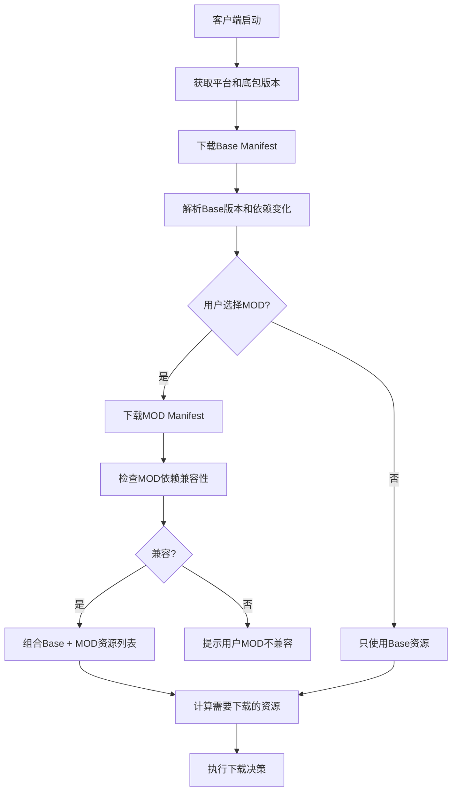

**关键优势**：
- ✅ **解耦设计**：Base和MOD完全独立，互不影响
- ✅ **按需加载**：客户端只下载需要的MOD Manifest
- ✅ **灵活组合**：用户可以自由选择启用哪些MOD
- ✅ **兼容性检查**：客户端在加载MOD时自动检查兼容性
- ✅ **简化管理**：管理端不需要维护聚合的Manifest文件

### 3.2 Manifest生成流程

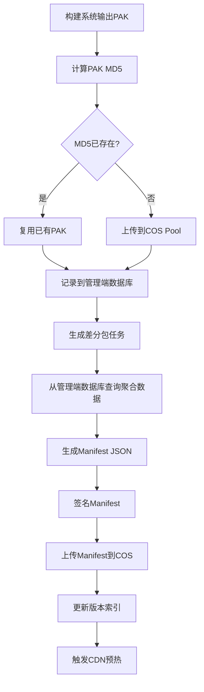

**核心设计理念**：

**✅ 管理端数据库是唯一数据源**：
- 所有PAK信息（MD5、大小、上传时间、平台等）存储在管理端数据库
- 所有MOD信息（版本、依赖关系、PAK列表等）存储在管理端数据库
- 所有差分包信息（from/to MD5、大小、生成时间等）存储在管理端数据库
- 所有版本历史和发布记录存储在管理端数据库

**✅ Manifest是数据视图（输出文件）**：
- Manifest文件是根据管理端数据库信息生成的JSON文件
- Manifest上传到COS后，作为客户端的数据视图
- Manifest不是数据源，而是数据的快照和展示形式
- 客户端只读取Manifest，不修改Manifest

**✅ 数据流向单向**：
```
管理端数据库（唯一数据源）
    ↓ 查询聚合
Manifest生成服务
    ↓ 输出JSON
COS Manifest文件（客户端数据视图）
    ↓ CDN分发
客户端读取
```

**✅ 管理端操作流程**：
1. **构建阶段**：PAK上传 → 记录到数据库 → 生成差分包 → 更新数据库
2. **发布阶段**：查询数据库 → 聚合数据 → 生成Manifest → 上传到COS
3. **查询阶段**：管理端需要信息时，直接查询数据库，不依赖Manifest
4. **回滚阶段**：查询历史版本数据 → 重新生成Manifest → 上传到COS

### 3.3 Manifest复用机制

#### 3.3.1 复用场景

**典型场景**：先遣环境中新增一个APP版本，但某MOD没有任何资产修改，可以基于之前的Manifest导出一份用于新的APP版本。

**复用条件**：
- MOD的PAK列表完全相同（基于content_hash判断）
- 目标平台相同
- 依赖的共享资源版本兼容

#### 3.3.2 复用流程

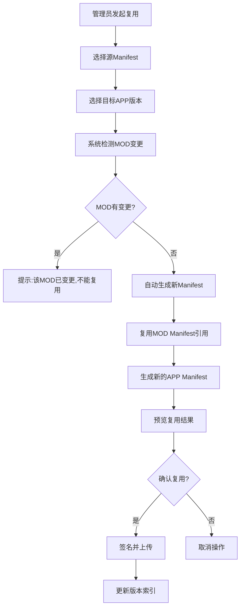

#### 3.3.3 管理端界面支持

**功能点**：
1. **复用检测**：自动检测哪些MOD可以复用
2. **批量复用**：支持一次性复用多个MOD的Manifest
3. **预览对比**：复用前预览新旧Manifest的差异
4. **一键复用**：确认后一键完成复用操作

**界面示意**：
```
┌─────────────────────────────────────────────────────────┐
│ Manifest复用工具                                         │
├─────────────────────────────────────────────────────────┤
│ 源APP版本: 1.0.0  →  目标APP版本: 1.1.0                  │
│ 平台: iOS                                                │
├─────────────────────────────────────────────────────────┤
│ MOD列表:                                                 │
│ ☑ mod_a (v1.2.3)  ✅ 可复用 (content_hash一致)          │
│ ☐ mod_b (v2.0.1)  ❌ 不可复用 (内容已变更)              │
│ ☑ mod_c (v1.0.0)  ✅ 可复用 (无变更)                    │
├─────────────────────────────────────────────────────────┤
│ [预览复用结果] [执行复用] [取消]                         │
└─────────────────────────────────────────────────────────┘
```

### 3.4 Manifest管理服务API设计

#### 3.4.1 核心接口

```go
// Manifest管理服务接口
type ManifestService interface {
    // 创建新Manifest
    CreateManifest(req *CreateManifestRequest) (*Manifest, error)
    
    // 获取Manifest
    GetManifest(appVersion, manifestID string) (*Manifest, error)
    
    // 获取最新Manifest
    GetLatestManifest(appVersion string, env Environment) (*Manifest, error)
    
    // 比较两个Manifest差异
    DiffManifest(fromID, toID string) (*ManifestDiff, error)
    
    // 合并多个MOD的Manifest
    MergeModManifests(modIDs []string) (*Manifest, error)
    
    // 回滚到指定Manifest
    RollbackManifest(manifestID string) error
    
    // 发布Manifest到指定环境
    PublishManifest(manifestID string, env Environment) error
}
```

#### 3.4.2 版本冲突解决策略

**场景**: 多个MOD同时更新时，可能依赖不同版本的共享PAK

**解决方案**:
1. **版本锁定**: 在Manifest中明确指定依赖的PAK版本
2. **依赖图检查**: 构建时检测循环依赖和版本冲突
3. **最小公共版本**: 自动选择满足所有MOD的最小公共版本
4. **冲突告警**: 无法自动解决时，阻止发布并告警

```go
// 依赖冲突检测
func (s *ManifestService) DetectConflicts(mods []*ModManifest) (*ConflictReport, error) {
    graph := buildDependencyGraph(mods)
    
    // 检测循环依赖
    if cycles := detectCycles(graph); len(cycles) > 0 {
        return &ConflictReport{Type: "circular_dependency", Cycles: cycles}, nil
    }
    
    // 检测版本冲突
    conflicts := detectVersionConflicts(graph)
    if len(conflicts) > 0 {
        return &ConflictReport{Type: "version_conflict", Conflicts: conflicts}, nil
    }
    
    return nil, nil
}
```

### 3.4 客户端下载决策原则

#### 3.4.1 决策原则

客户端根据Manifest中的资产清单，智能决策每个PAK的下载方式（增量/全量）。决策流程完全由客户端驱动，服务端只提供Manifest和资源文件。

**核心原则**：
1. **Manifest驱动**：所有下载决策基于Manifest中的PAK列表和差分包信息
2. **智能选择**：优先使用差分包，失败时自动降级到全量下载
3. **多重降级**：差分包应用失败 → 全量下载 → 使用本地缓存 → 使用底包资源
4. **环境感知**：根据网络环境（WiFi/4G/5G）和存储空间动态调整策略

#### 3.4.2 决策算法

```cpp
// 客户端下载决策伪代码
DownloadStrategy DecideDownloadStrategy(const FPakInfo& PakInfo) {
    // 1. 检查本地是否已有该PAK（基于MD5）
    if (LocalPakExists(PakInfo.MD5) && VerifyLocalPak(PakInfo.MD5)) {
        return DownloadStrategy::Skip;  // 跳过下载
    }
    
    // 2. 检查是否有可用的差分包
    FString LocalMD5 = GetLocalPakMD5(PakInfo.Name);
    if (!LocalMD5.IsEmpty()) {
        FPatchInfo* Patch = FindPatch(LocalMD5, PakInfo.MD5);
        if (Patch != nullptr) {
            // 评估差分包是否值得使用
            if (ShouldUsePatch(Patch, PakInfo)) {
                return DownloadStrategy::Patch;  // 使用差分包
            }
        }
    }
    
    // 3. 默认全量下载
    return DownloadStrategy::Full;
}

// 评估差分包是否值得使用
bool ShouldUsePatch(const FPatchInfo* Patch, const FPakInfo& PakInfo) {
    // 因素1：差分包大小 vs 完整PAK大小
    float SizeRatio = (float)Patch->Size / PakInfo.Size;
    if (SizeRatio > 0.7f) {
        return false;  // 差分包太大，不如全量下载
    }
    
    // 因素2：网络环境（WiFi优先全量，4G优先差分）
    if (IsWiFiConnected() && PakInfo.Size < 100 * 1024 * 1024) {
        return false;  // WiFi环境下，小于100MB直接全量下载
    }
    
    // 因素3：存储空间（差分包需要额外空间）
    int64 RequiredSpace = Patch->Size + PakInfo.Size;  // 差分包+新PAK
    if (GetAvailableSpace() < RequiredSpace * 1.5f) {
        return false;  // 存储空间不足
    }
    
    return true;
}
```

#### 3.4.3 下载流程

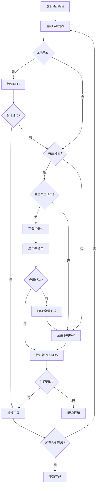

#### 3.4.4 降级策略

| 场景 | 降级方案 | 说明 |
|------|---------|------|
| 差分包下载失败 | 全量下载PAK | 网络问题或差分包不存在 |
| 差分包应用失败 | 全量下载PAK | 差分包损坏或本地PAK异常 |
| 全量下载失败 | 使用本地缓存 | 如果本地有旧版本PAK |
| 本地缓存不可用 | 使用底包资源 | 降级到APP内置的基础资源 |
| 底包资源缺失 | 提示用户重新安装 | 最后的兜底方案 |

#### 3.4.5 接口规范

**Manifest接口**（客户端从CDN获取）：
```
GET https://cdn.xxx.com/manifests/app/{platform}/{app_version}_latest.json

Response:
{
  "manifest_id": "...",
  "platforms": {
    "ios": {
      "mod_manifests": [
        {
          "mod_id": "mod_a",
          "mod_manifest_url": "manifests/mod/mod_a/ios/1.2.3_20260110.json"
        }
      ]
    }
  }
}
```

**MOD Manifest接口**：
```
GET https://cdn.xxx.com/manifests/mod/mod_a/ios/1.2.3_20260110.json

Response:
{
  "paks": [
    {
      "pak_name": "mod_a_level_01.pak",
      "pak_md5": "abcdef123456...",
      "cdn_url": "https://cdn-ios.xxx.com/pak/ab/abcdef123456...pak",
      "patches": [
        {
          "from_md5": "xyz789...",
          "patch_url": "https://cdn-ios.xxx.com/patch/12/xyz789_to_abcdef.hdiff",
          "patch_size": 10240
        }
      ]
    }
  ]
}
```

---

## 四、差分包生成与管理策略

### 4.1 差分包生成时机与策略

#### 4.1.1 生成时机（管理端全链路支持）

**方案：管理端驱动的灵活生成策略**

差分包生成由管理端统一调度，支持两种生成时机：

**时机1：构建时同步生成（推荐）**
```
构建PAKs/Diffs → 上传PAKs/Diffs → 构建Manifest → 发布
```
- ✅ 优点：Manifest发布时差分包已就绪，用户体验最佳
- ❌ 缺点：构建流程较长，阻塞Manifest发布
- 🎯 适用场景：正式环境发布、重要版本更新

**时机2：构建后异步生成**
```
构建PAKs → 上传PAKs → 构建Manifest(v1) → 发布
                    ↓
              异步生成Diffs → 刷新Manifest(v2) → 重新发布
```
- ✅ 优点：不阻塞Manifest发布，构建流程快
- ❌ 缺点：短期内用户只能全量下载
- 🎯 适用场景：测试环境、紧急修复

**管理端支持**：
- 管理端数据库保存完整的Manifest构建信息
- 支持在任意时刻补充生成差分包
- 差分包生成完成后，自动刷新Manifest并重新上传
- 提供差分包生成进度监控和失败重试

#### 4.1.2 生成流程

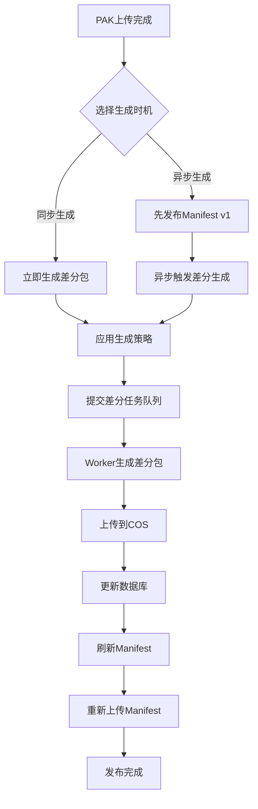

#### 4.1.3 配置结构（简化版）

```go
type PatchGenerationConfig struct {
    // ===== 门槛配置（核心） =====
    MinPakSize           int64   // 最小PAK大小（默认1MB）
    MaxPakSize           int64   // 最大PAK大小（默认1GB）
    MinCompressionRatio  float64 // 最小压缩率（默认0.7）
    
    // ===== 基准版本选择（简化） =====
    RecentVersionCount   int      // 最近N个版本（默认3）
    ManualVersions       []string // 手动指定的版本MD5列表
    
    // ===== 告警配置（而非硬性限制） =====
    MaxPatchCount        int      // 差分包数量告警阈值（默认5）
    WarnOnExceed         bool     // 超过阈值时是否告警（默认true）
}
```

**配置说明**：
- 门槛配置：基于PAK大小和压缩率判断是否生成差分包
- 基准版本选择：支持最近N个版本和手动指定版本两种策略
- 告警配置：MaxPatchCount作为告警阈值，不阻止生成，只提示超过阈值

#### 4.1.4 基准版本选择算法（简化版）

```python
def select_base_versions(
    pak_name: str,
    platform: Platform,
    config: PatchGenerationConfig
) -> List[PakInfo]:
    """
    选择基准版本（简化版）
    """
    base_versions = []
    
    # 策略1：最近N个版本
    recent_versions = get_recent_versions(pak_name, platform, config.recent_version_count)
    base_versions.extend(recent_versions)
    
    # 策略2：手动指定的版本
    for version_md5 in config.manual_versions:
        pak_info = get_pak_by_md5(version_md5, platform)
        if pak_info and pak_info not in base_versions:
            base_versions.append(pak_info)
    
    # 去重
    base_versions = list(set(base_versions))
    
    return base_versions


def should_generate_patch(
    from_pak: PakInfo, 
    to_pak: PakInfo, 
    config: PatchGenerationConfig
) -> Tuple[bool, str]:
    """
    判断是否应该生成差分包（简化版）
    返回: (是否生成, 原因)
    """
    # 门槛1：目标PAK太小（< 1MB）
    if to_pak.size < config.min_pak_size:
        return False, f"Target PAK too small: {to_pak.size} < {config.min_pak_size}"
    
    # 门槛2：目标PAK太大（> 1GB）
    if to_pak.size > config.max_pak_size:
        return False, f"Target PAK too large: {to_pak.size} > {config.max_pak_size}"
    
    return True, "OK"


def generate_patches_with_warning(
    pak_md5: str, 
    platform: Platform,
    config: PatchGenerationConfig
) -> PatchGenerationResult:
    """
    生成差分包（带告警检查）
    """
    # 1. 选择基准版本
    base_versions = select_base_versions(pak_md5, platform, config)
    
    # 2. 计算总数量
    total_count = len(base_versions)
    
    # 3. 告警检查（而非阻止）
    if config.warn_on_exceed and total_count > config.max_patch_count:
        warning = f"""
        ⚠️ 差分包数量({total_count})超过告警阈值({config.max_patch_count})，预计生成耗时较长。
          - 最近{config.recent_version_count}个版本: {len(recent_versions)}个
          - 手动指定版本: {len(config.manual_versions)}个
        建议: 减少手动指定的版本数量或调整最近版本数量。
        """
        
        # 记录告警日志
        logger.warn(warning)
        
        # 返回告警信息（但不阻止生成）
        return PatchGenerationResult(
            warning=warning,
            base_versions=base_versions,
            estimated_time=estimate_generation_time(total_count),
        )
    
    # 4. 继续生成差分包
    return do_generate_patches(base_versions)
```

#### 4.1.5 差分包生成流程（管理端视角）

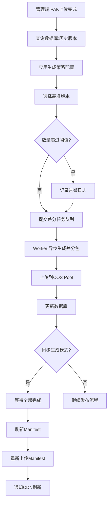

**管理端职责**：
1. 维护完整的PAK版本历史（数据库）
2. 根据配置决策差分包生成策略
3. 调度差分包生成任务
4. 监控生成进度和成功率
5. 差分包完成后自动刷新Manifest
6. 提供手动补充生成差分包的入口

### 4.2 差分包命名与存储

**命名规则**:
```
{from_md5_prefix}_{to_md5_prefix}.hdiff
例: 123456_789abc.hdiff
```

**存储路径**（包含平台维度）:
```
pool/patch/{platform}/{to_md5前2位}/{from_md5前6位}_to_{to_md5前6位}.hdiff

示例：
pool/patch/ios/78/123456_to_789abc.hdiff      # iOS平台
pool/patch/android/78/123456_to_789abc.hdiff  # Android平台
pool/patch/pc/78/123456_to_789abc.hdiff       # PC平台
```

**关键点**：
- ✅ 按平台隔离存储
- ✅ 使用MD5前2位分片（256个目录）
- ✅ 文件名包含from和to的MD5前缀，便于识别

### 4.3 差分包注册表设计

```json
{
  "patch_id": "uuid",
  "platform": "ios",  // 平台标识
  "from_pak_md5": "123456...",
  "to_pak_md5": "789abc...",
  "patch_size": 10240,
  "compression_ratio": 0.1,
  "patch_url": "pool/patch/ios/78/123456_to_789abc.hdiff",  // 包含平台路径
  "created_at": "2026-01-10T12:00:00Z",
  "status": "active",  // active | deprecated | deleted
  "download_count": 1000,
  "success_rate": 0.98
}
```

---

## 五、资源清理服务方案

### 5.1 清理策略设计

#### 5.1.1 PAK文件清理规则

**保留条件**（满足任一即保留）:
1. 被任何活跃Manifest引用
2. 属于最近3个月的版本
3. 用户占比 > 1%
4. 标记为"重要版本"（如底包版本）

**清理条件**（同时满足才清理）:
1. 未被任何Manifest引用
2. 创建时间 > 6个月
3. 最近30天下载量 < 10次

#### 5.1.2 差分包清理规则

**清理条件**:
1. 基准版本已被清理
2. 目标版本已被清理
3. 创建时间 > 3个月 且 下载量 < 5次
4. 标记为"失效"状态

#### 5.1.3 Manifest清理规则

**保留策略**:
1. 每个APP版本保留最近10个Manifest
2. 标记为"重要版本"的Manifest永久保留
3. 最近30天的Manifest全部保留

### 5.2 清理服务架构

```go
type CleanupService struct {
    cosClient    *cos.Client
    db           *sql.DB
    redis        *redis.Client
    config       *CleanupConfig
}

type CleanupConfig struct {
    DryRun              bool          // 是否为模拟运行
    PakRetentionDays    int           // PAK保留天数
    PatchRetentionDays  int           // 差分包保留天数
    MinUserPercentage   float64       // 最小用户占比
    CleanupBatchSize    int           // 批量清理大小
    CleanupInterval     time.Duration // 清理间隔
}

// 执行清理任务
func (s *CleanupService) RunCleanup() error {
    // 1. 扫描待清理资源
    candidates := s.scanCleanupCandidates()
    
    // 2. 安全检查
    safeToDelete := s.safetyCheck(candidates)
    
    // 3. 生成清理报告
    report := s.generateCleanupReport(safeToDelete)
    
    // 4. 执行清理（需人工审批）
    if !s.config.DryRun {
        s.executeCleanup(safeToDelete)
    }
    
    // 5. 记录清理日志
    s.logCleanup(report)
    
    return nil
}
```

### 5.3 清理流程

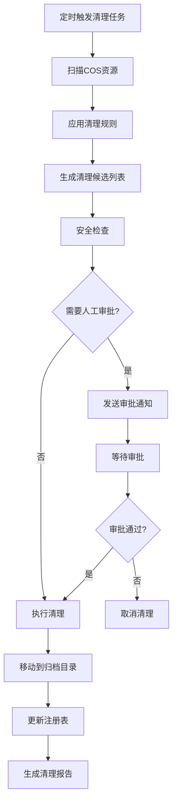

### 5.4 成本优化建议

1. **分层存储**: 
   - 热数据（最近30天）: COS标准存储
   - 温数据（30-90天）: COS低频存储
   - 冷数据（90天+）: COS归档存储

2. **CDN缓存策略**:
   - 热门PAK: 缓存7天
   - 普通PAK: 缓存1天
   - 差分包: 缓存3天

3. **压缩优化**:
   - PAK文件使用UE4内置压缩
   - 差分包使用HDiffPatch压缩

---

## 六、管理端架构设计

### 6.1 系统架构图

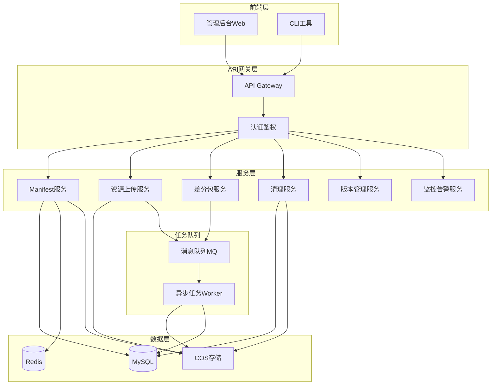

### 6.2 核心功能模块

#### 6.2.1 资源构建与上传模块

**功能**:
- 接收构建系统输出的PAK文件
- 计算MD5并检查是否已存在
- 上传新PAK到COS Pool
- 更新PAK注册表

**接口**:
```go
// 上传PAK文件
POST /api/v1/resources/upload
Request:
{
  "mod_id": "mod_a",
  "app_version": "1.0.0",
  "files": [
    {
      "file_name": "mod_a_level_01.pak",
      "file_path": "/path/to/pak",
      "mount_point": "/Game/ModA/"
    }
  ]
}

Response:
{
  "upload_id": "uuid",
  "results": [
    {
      "file_name": "mod_a_level_01.pak",
      "md5": "abcdef123456...",
      "status": "uploaded" | "skipped",  // skipped表示已存在
      "url": "pool/pak/ab/abcdef123456...pak"
    }
  ]
}
```

#### 6.2.2 Manifest构建与发布模块

**功能**:
- 创建新Manifest
- 合并多个MOD的Manifest
- 版本冲突检测
- Manifest签名与验证
- 发布到指定环境

**工作流**:
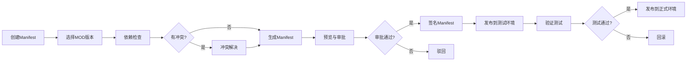

#### 6.2.3 差分包管理模块

**功能**:
- 自动触发差分包生成任务
- 监控差分包生成进度
- 差分包质量检查（大小、成功率）
- 差分包失效管理

**任务调度**:
```python
class PatchGenerationScheduler:
    def on_new_pak_uploaded(self, pak_md5: str):
        """新PAK上传时触发"""
        base_versions = select_base_versions(pak_md5)
        for base_md5 in base_versions:
            task = PatchGenerationTask(
                from_md5=base_md5,
                to_md5=pak_md5,
                priority=calculate_priority(base_md5)
            )
            self.task_queue.enqueue(task)
    
    def on_patch_generated(self, patch_info: PatchInfo):
        """差分包生成完成时触发"""
        # 质量检查
        if patch_info.size > patch_info.original_size * 0.7:
            self.mark_as_inefficient(patch_info)
        else:
            self.register_patch(patch_info)
            self.update_manifest(patch_info)
```

#### 6.2.4 版本管理与回滚模块

**功能**:
- 版本历史查询
- 版本对比
- 一键回滚
- Manifest复用

**回滚流程**:
```go
func (s *VersionService) Rollback(targetManifestID string) error {
    // 1. 验证目标Manifest存在且有效
    targetManifest, err := s.GetManifest(targetManifestID)
    if err != nil {
        return err
    }
    
    // 2. 检查所有引用的PAK是否仍然存在
    if err := s.validatePakAvailability(targetManifest); err != nil {
        return fmt.Errorf("回滚失败: %w", err)
    }
    
    // 3. 创建回滚快照
    snapshot := s.createSnapshot(s.getCurrentManifest())
    
    // 4. 切换Manifest
    if err := s.switchManifest(targetManifestID); err != nil {
        return err
    }
    
    // 5. 触发CDN刷新
    s.cdnService.Refresh(targetManifest.GetCDNUrls())
    
    // 6. 记录回滚日志
    s.logRollback(targetManifestID, snapshot)
    
    return nil
}
```

#### 6.2.5 监控告警模块

**监控指标**:
1. **资源指标**:
   - COS存储用量
   - CDN流量消耗
   - PAK下载成功率
   - 差分包应用成功率

2. **业务指标**:
   - 用户版本分布
   - 更新完成率
   - 平均下载时长
   - 回滚次数

3. **系统指标**:
   - API响应时间
   - 任务队列积压
   - 服务可用性

**告警规则**:
```yaml
alerts:
  - name: pak_download_failure_rate_high
    condition: pak_download_failure_rate > 0.05
    duration: 5m
    severity: critical
    action: notify_oncall
    
  - name: manifest_publish_failed
    condition: manifest_publish_status == "failed"
    severity: critical
    action: notify_oncall
    
  - name: cos_storage_usage_high
    condition: cos_storage_usage > 0.8
    duration: 1h
    severity: warning
    action: notify_admin
```

### 6.3 数据库设计

#### 6.3.1 核心表结构

```sql
-- PAK注册表（增加平台字段）
CREATE TABLE pak_registry (
    id BIGINT PRIMARY KEY AUTO_INCREMENT,
    pak_md5 VARCHAR(64),
    platform VARCHAR(20),              -- 平台标识
    pak_name VARCHAR(255) NOT NULL,
    pak_size BIGINT NOT NULL,
    compressed_size BIGINT,
    cos_url VARCHAR(512) NOT NULL,
    cdn_url VARCHAR(512),
    upload_time DATETIME NOT NULL,
    last_access_time DATETIME,
    download_count BIGINT DEFAULT 0,
    status ENUM('active', 'deprecated', 'deleted') DEFAULT 'active',
    
    PRIMARY KEY (pak_md5, platform),   -- 联合主键
    INDEX idx_platform (platform),
    INDEX idx_status (status),
    INDEX idx_upload_time (upload_time)
) ENGINE=InnoDB DEFAULT CHARSET=utf8mb4;

-- 差分包注册表（增加平台字段）
CREATE TABLE patch_registry (
    id BIGINT PRIMARY KEY AUTO_INCREMENT,
    patch_id VARCHAR(64) UNIQUE NOT NULL,
    platform VARCHAR(20),              -- 平台标识
    from_pak_md5 VARCHAR(64) NOT NULL,
    to_pak_md5 VARCHAR(64) NOT NULL,
    patch_size BIGINT NOT NULL,
    compression_ratio DECIMAL(5,4),
    cos_url VARCHAR(512) NOT NULL,
    created_at DATETIME NOT NULL,
    status ENUM('active', 'deprecated', 'deleted') DEFAULT 'active',
    download_count BIGINT DEFAULT 0,
    success_count BIGINT DEFAULT 0,
    
    PRIMARY KEY (patch_id, platform),  -- 联合主键
    INDEX idx_platform (platform),
    INDEX idx_from_to (from_pak_md5, to_pak_md5, platform),
    INDEX idx_status (status)
) ENGINE=InnoDB DEFAULT CHARSET=utf8mb4;

-- MOD Manifest索引表（增加平台字段）
CREATE TABLE mod_manifest_index (
    id BIGINT PRIMARY KEY AUTO_INCREMENT,
    mod_manifest_id VARCHAR(128) UNIQUE NOT NULL,
    mod_id VARCHAR(64) NOT NULL,
    mod_version VARCHAR(32) NOT NULL,
    platform VARCHAR(20),              -- 平台标识
    content_hash VARCHAR(64),
    cos_url VARCHAR(512) NOT NULL,
    created_at DATETIME NOT NULL,
    
    INDEX idx_mod_platform (mod_id, platform, mod_version),
    UNIQUE KEY uk_mod_version_platform (mod_id, mod_version, platform)
) ENGINE=InnoDB DEFAULT CHARSET=utf8mb4;

-- APP Manifest索引表（包含所有平台）
CREATE TABLE app_manifest_index (
    id BIGINT PRIMARY KEY AUTO_INCREMENT,
    manifest_id VARCHAR(128) UNIQUE NOT NULL,
    app_version VARCHAR(32) NOT NULL,
    environment ENUM('test', 'preview', 'prod') NOT NULL,
    platforms JSON,                    -- 包含的平台列表 ["ios", "android", ...]
    cos_url VARCHAR(512) NOT NULL,
    created_at DATETIME NOT NULL,
    published_at DATETIME,
    status ENUM('draft', 'testing', 'published', 'deprecated') DEFAULT 'draft',
    creator VARCHAR(64),
    
    INDEX idx_app_env (app_version, environment),
    INDEX idx_status (status)
) ENGINE=InnoDB DEFAULT CHARSET=utf8mb4;

-- Manifest表（保留原有结构，用于详细信息）
CREATE TABLE manifests (
    id BIGINT PRIMARY KEY AUTO_INCREMENT,
    manifest_id VARCHAR(64) UNIQUE NOT NULL,
    app_version VARCHAR(32) NOT NULL,
    manifest_version VARCHAR(64) NOT NULL,
    parent_manifest_id VARCHAR(64),
    is_full BOOLEAN DEFAULT FALSE,
    manifest_json TEXT NOT NULL,
    signature VARCHAR(512),
    created_at DATETIME NOT NULL,
    published_at DATETIME,
    status ENUM('draft', 'testing', 'published', 'deprecated') DEFAULT 'draft',
    environment ENUM('test', 'preview', 'prod') NOT NULL,
    creator VARCHAR(64),
    INDEX idx_app_version (app_version),
    INDEX idx_status (status),
    INDEX idx_env (environment)
) ENGINE=InnoDB DEFAULT CHARSET=utf8mb4;

-- MOD版本表
CREATE TABLE mod_versions (
    id BIGINT PRIMARY KEY AUTO_INCREMENT,
    mod_id VARCHAR(64) NOT NULL,
    mod_name VARCHAR(255) NOT NULL,
    mod_version VARCHAR(32) NOT NULL,
    manifest_id VARCHAR(64) NOT NULL,
    created_at DATETIME NOT NULL,
    INDEX idx_mod_id (mod_id),
    INDEX idx_manifest (manifest_id)
) ENGINE=InnoDB DEFAULT CHARSET=utf8mb4;

-- 版本历史表
CREATE TABLE version_history (
    id BIGINT PRIMARY KEY AUTO_INCREMENT,
    manifest_id VARCHAR(64) NOT NULL,
    action ENUM('create', 'publish', 'rollback', 'deprecate') NOT NULL,
    operator VARCHAR(64),
    reason TEXT,
    created_at DATETIME NOT NULL,
    INDEX idx_manifest (manifest_id),
    INDEX idx_action (action)
) ENGINE=InnoDB DEFAULT CHARSET=utf8mb4;

-- 清理日志表
CREATE TABLE cleanup_logs (
    id BIGINT PRIMARY KEY AUTO_INCREMENT,
    cleanup_id VARCHAR(64) UNIQUE NOT NULL,
    resource_type ENUM('pak', 'patch', 'manifest') NOT NULL,
    resource_count INT NOT NULL,
    freed_size BIGINT,
    executed_at DATETIME NOT NULL,
    operator VARCHAR(64),
    status ENUM('success', 'failed', 'partial') NOT NULL,
    details TEXT,
    INDEX idx_executed_at (executed_at)
) ENGINE=InnoDB DEFAULT CHARSET=utf8mb4;
```

### 6.4 管理后台功能清单

#### 6.4.1 资源管理页面
- PAK文件列表与搜索
- PAK上传与删除
- PAK引用关系查看
- 差分包列表与状态

#### 6.4.2 版本管理页面
- Manifest列表与搜索
- 创建新Manifest
- Manifest对比工具
- 版本发布流程
- 回滚操作

#### 6.4.3 MOD管理页面
- MOD列表与配置
- MOD依赖关系图
- MOD独立更新
- MOD版本历史

#### 6.4.4 监控大盘
- 实时监控指标
- 用户版本分布图
- 资源使用趋势
- 告警历史

#### 6.4.5 运维工具
- 资源清理工具
- 批量操作工具
- 日志查询
- 审计日志

---

## 七、完整数据流转链路

### 7.1 资源构建与发布流程

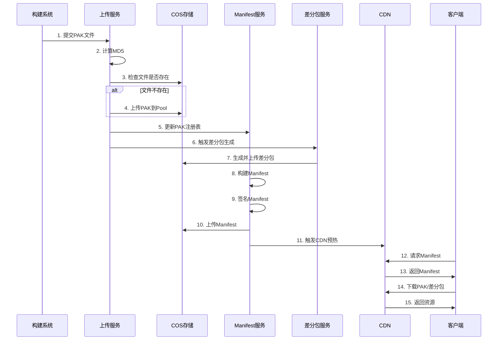

### 7.2 客户端更新流程

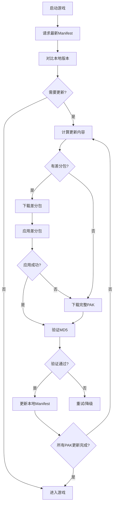

---

## 八、关键技术细节

### 8.1 MD5分片策略

**为什么使用MD5前2位分片？**
- 5000个PAK文件，均匀分布到256个目录（16^2）
- 每个目录约20个文件，避免单目录文件过多
- 便于COS的性能优化和并发访问

### 8.2 版本号规则详解

#### 8.2.1 底包版本号（App Version）

**格式**: `A.B.C`（3位语义化版本）
- **A (Major)**: 大版本，破坏性变更（如引擎升级、架构重构）
- **B (Minor)**: 功能版本，新增功能（如新玩法、新系统）
- **C (Patch)**: 修复版本，Bug修复和小优化

**示例**:
- `1.0.0`: 首个正式版本
- `1.1.0`: 新增社交系统
- `1.1.1`: 修复社交系统Bug
- `2.0.0`: 引擎升级到UE5

**变更频率**: 约2个月一次（可上下浮动）

#### 8.2.2 Base资源版本号（Base Version）⭐

**格式**: `A.B.C.x`（4位版本号）
- **A.B.C**: 对应的底包版本（前3位必须匹配）
- **x**: Base资源热更新序号（从1开始递增）

**示例**:
```
底包 1.0.0:
  → Base 1.0.0.1 (首次Base资源)
  → Base 1.0.0.2 (修复材质Bug)
  → Base 1.0.0.3 (优化粒子效果)

底包 1.1.0:
  → Base 1.1.0.1 (新玩法Base资源)
  → Base 1.1.0.2 (新增共享资源)
```

**规则**:
1. Base资源版本的前3位必须与底包版本一致
2. 第4位从1开始，每次Base资源更新递增
3. 不同底包版本的Base资源版本号独立计数

**变更频率**: 每周或每月（根据需求）

#### 8.2.3 MOD版本号（MOD Version）⭐

**格式**: `W.X.Y.Z`（4位版本号）
- **W.X.Y.Z**: MOD独立的4位版本号，不强制与底包版本号关联
- 每个MOD自行管理版本号递增规则（建议采用语义化版本规范）

**版本号规则**:
1. MOD版本号独立管理，不需要与底包版本号保持一致
2. 建议采用语义化版本规范：
   - **W（主版本号）**: 重大功能变更或不兼容更新
   - **X（次版本号）**: 新增功能，向后兼容
   - **Y（修订号）**: Bug修复，向后兼容
   - **Z（构建号）**: 小修改或热修复
3. 每个二进制版本有独立的Manifest，不考虑跨二进制版本兼容 ⭐

**示例**:
```
底包 1.0.0:
  → MOD A 1.0.0.1 (首次发布)
  → MOD A 1.0.0.2 (Bug修复，递增版本号)
  → MOD A 1.0.0.3 (新增内容，递增版本号)

底包 1.1.0:
  → MOD A 1.1.0.1 (新底包下的首次发布，重新开始版本号)
  → MOD A 1.1.0.3 (Bug修复)
```

**依赖声明示例**:
```json
{
  "mod_version": "1.0.0.1",  // MOD独立的4位版本号
  "dependencies": {
    "platform_base": {
      "app_version": "1.0.0",              // 依赖的底包版本（必须匹配）⭐
      "min_base_version": "1.0.0.1",       // 最低兼容Base版本
      "max_base_version": "1.0.0.5"        // 最高兼容Base版本
    }
  }
}
```

**优势**:
- ✅ 简化版本管理：MOD版本号独立，不受底包版本号约束
- ✅ 清晰的依赖关系：通过`app_version`明确依赖的底包版本
- ✅ 避免跨版本混淆：每个二进制版本有独立的Manifest
- ✅ 灵活的版本策略：MOD可以自行决定版本号递增规则

#### 8.2.4 版本兼容性检查算法

```go
func CheckVersionCompatibility(
    mod *ModManifest,
    base *BaseManifest,
) error {
    dep := mod.Dependencies.PlatformBase
    
    // 检查1：底包版本必须匹配 ⭐
    if base.AppVersion != dep.AppVersion {
        return fmt.Errorf(
            "底包版本不匹配: MOD需要 %s, 实际 %s",
            dep.AppVersion,
            base.AppVersion,
        )
    }
    
    // 检查2：Base版本范围
    if !IsVersionInRange(
        base.BaseVersion,
        dep.MinBaseVersion,
        dep.MaxBaseVersion,
    ) {
        return fmt.Errorf(
            "Base版本不兼容: 需要 %s-%s, 实际 %s",
            dep.MinBaseVersion,
            dep.MaxBaseVersion,
            base.BaseVersion,
        )
    }
    
    return nil
}

// 从Base版本提取底包版本
func ExtractAppVersion(baseVersion string) string {
    // "1.0.0.5" → "1.0.0"
    parts := strings.Split(baseVersion, ".")
    if len(parts) == 4 {
        return strings.Join(parts[:3], ".")
    }
    return baseVersion
}
```

#### 8.2.5 版本号最佳实践

| 场景 | 推荐做法 |
|------|----------|
| **Base资源Bug修复** | 递增第4位：1.0.0.1 → 1.0.0.2 |
| **Base资源新增内容** | 递增第4位：1.0.0.2 → 1.0.0.3 |
| **Base有破坏性变化** | 设置`has_breaking_changes: true`，提示MOD开发者 ⭐ |
| **底包大版本更新** | 重置Base版本：1.0.0.x → 2.0.0.1 |
| **MOD独立更新** | 递增版本号：1.0.0.1 → 1.0.0.2 ⭐ |
| **MOD适配新底包** | 创建新Manifest，版本号重新开始：1.1.0.1 ⭐ |

### 8.3 差分包大小阈值

**参考iWiki文档的20M-1000M阈值**:
- **< 20M**: 不生成差分包，直接全量下载
- **20M - 1000M**: 生成差分包
- **> 1000M**: 评估差分包效果，可能拆分PAK

**优化建议**:
- 根据实际数据调整阈值
- 考虑网络环境（WiFi vs 4G）动态调整

### 8.4 签名与防篡改

**Manifest签名**:
```go
func SignManifest(manifest *Manifest, privateKey *rsa.PrivateKey) (string, error) {
    // 1. 序列化Manifest（排除signature字段）
    data, _ := json.Marshal(manifest)
    
    // 2. 计算SHA256哈希
    hash := sha256.Sum256(data)
    
    // 3. RSA签名
    signature, err := rsa.SignPKCS1v15(rand.Reader, privateKey, crypto.SHA256, hash[:])
    if err != nil {
        return "", err
    }
    
    // 4. Base64编码
    return base64.StdEncoding.EncodeToString(signature), nil
}
```

**客户端验证**:
```cpp
bool VerifyManifest(const FString& ManifestJson, const FString& Signature) {
    // 1. 解析公钥
    // 2. Base64解码签名
    // 3. 计算Manifest的SHA256
    // 4. RSA验证签名
    return RSAVerify(PublicKey, Hash, Signature);
}
```

---

## 九、风险与应对

### 9.1 技术风险

| 风险 | 影响 | 概率 | 应对措施 |
|------|------|------|----------|
| COS故障导致资源不可用 | 高 | 低 | 1. 多地域容灾<br>2. 本地缓存<br>3. 降级到底包资源 |
| 差分包应用失败 | 中 | 中 | 1. 自动降级全量下载<br>2. 差分包质量检查<br>3. 客户端重试机制 |
| Manifest冲突导致游戏崩溃 | 高 | 低 | 1. 严格的依赖检查<br>2. 环境隔离测试<br>3. 快速回滚能力 |
| 存储成本超预算 | 中 | 中 | 1. 自动化清理<br>2. 分层存储<br>3. 成本监控告警 |

### 9.2 业务风险

| 风险 | 影响 | 概率 | 应对措施 |
|------|------|------|----------|
| 更新失败率高影响用户体验 | 高 | 中 | 1. 多重降级策略<br>2. 断点续传<br>3. 网络环境检测 |
| 回滚操作失误 | 高 | 低 | 1. 回滚前快照<br>2. 二次确认机制<br>3. 审计日志 |
| MOD依赖关系复杂导致管理困难 | 中 | 高 | 1. 可视化依赖图<br>2. 自动化冲突检测<br>3. 版本锁定机制 |
| 差分包生成耗时过长 | 中 | 中 | 1. 异步生成模式<br>2. 告警阈值配置<br>3. 优先级队列调度 |

---

## 十、实施计划建议

### 10.1 分阶段实施

**Phase 1: 基础设施**
- COS目录结构搭建
- 基础数据库表设计
- PAK上传服务开发

**Phase 2: 核心服务**
- Manifest生成与管理服务
- 差分包生成服务
- 版本管理服务

**Phase 3: 管理后台**
- 管理后台UI开发
- 监控大盘
- 运维工具

**Phase 4: 高级功能**
- 资源清理服务
- Manifest复用功能
- 性能优化

**Phase 5: 测试与上线**
- 集成测试
- 压力测试
- 灰度上线

### 10.2 技术栈建议

**后端**:
- 语言: Go（高性能、并发友好）
- 框架: Gin/Echo
- 数据库: MySQL 8.0
- 缓存: Redis 6.0
- 消息队列: RabbitMQ/Kafka

**前端**:
- 框架: Vue 3 + TypeScript
- UI库: Element Plus
- 图表: ECharts

**运维**:
- 容器化: Docker + Kubernetes
- 监控: Prometheus + Grafana
- 日志: ELK Stack

---

## 十一、总结

本方案基于UE4游戏平台的实际需求，设计了一套完整的基于COS的PAK资源管理系统。核心特点包括：

1. **高效存储**: 基于MD5的内容寻址，避免重复上传，支持跨版本复用
2. **灵活更新**: 支持MOD独立更新，差分包智能生成，多重降级策略
3. **安全可靠**: 三环境隔离，Manifest签名，快速回滚能力
4. **成本可控**: 自动化清理，分层存储，成本监控告警
5. **易于运维**: 完整的管理后台，可视化监控，审计日志

该方案在参考iWiki文档的基础上，针对5000+ PAK文件、多MOD、多环境的复杂场景进行了深度优化，是一套务实可行的技术方案。

---

**附录**:
- A. API接口详细文档
- B. 数据库完整DDL
- C. 客户端集成指南
- D. 运维手册

---

**文档状态**: 待评审  
**下一步**: 技术评审会议，确认方案细节